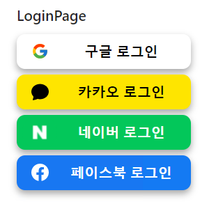
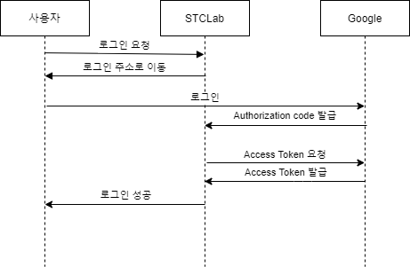
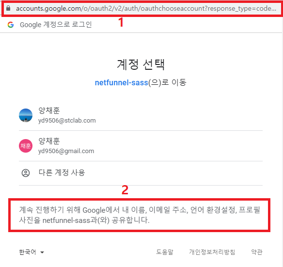

# OAuth 2.0

OAuth 2.0은 카카오, 구글, 네이버 등의 아이디로 제 3의 서비스(Netfunnel SaaS)에 로그인하여 카카오, 구글의 정보 또는 기능에 접근할 수 있는 권한을 제어하기 위한 표준 프로토콜입니다. OAuth 프로토콜을 통해 사용자가 우리의 서비스에서 카카오 친구 정보 또는 페이스북에 글 쓰기 등의 작업을 안전하게 진행할 수 있습니다.


## 소셜 로그인

OAuth 프로토콜을 사용한 대표적인 기능 중 하나가 소셜 로그인입니다. 



소셜 로그인은 주로 위의 사진과 같은 형태로 이용합니다. 로그인 버튼을 클릭하면 해당 소셜에 로그인하는 화면이 나타나고, 사용자가 로그인을 하면 몇 단계의 과정을 거쳐 구글 또는 카카오 등에서 자신의 서비스를 이용할 수 있는 액세스 토큰을 발급합니다. 우리 서비스는 액세스 토큰을 가지고 해당 서비스의 기능을 이용할 권한을 얻게 됩니다. 로그인은 주로 액세스 토큰을 발급 받기 까지의 과정을 말합니다.


### 소셜 로그인 단계

시작하기 전에, Client ID과 Client Secret을 발급받고, Redirect URI 를 등록하는 작업을 진행해야 합니다. 이 과정은 아래의 사이트에서 할 수 있습니다.

[Google Cloud Platform]: https://console.cloud.google.com/apis/dashboard?hl=ko&amp;pli=1&amp;project=golden-argon-315807&amp;folder=&amp;organizationId=
[Naver Developers]: https://developers.naver.com/main/
[Facebook for Developers]: https://developers.facebook.com/




소셜 로그인을 간단하게 표현하면 위의 사진과 같습니다.

1. 사용자가 로그인 버튼을 클릭
2. 구글의 로그인 페이지로 이동
3. 사용자가 구글에 로그인
4. 구글이 STCLab에게 Authorization code 발급
5. STCLab이 구글에 Access token 요청
6. 구글이 STCLab에게 Access token 발급
7. 로그인 성공

위의 단계를 Authorization code를 발급 받는 과정과 Access token을 발급 받는 과정으로 나눠서 살펴보도록 하겠습니다.


### Authorization Code 발급

* 용어 정리
  * 사용자: 서비스를 이용하는 사용자
  * 클라이언트: 제 3의 서비스, Netfunnel SaaS 등 소셜 로그인을 이용하려는 서비스
  * Resource Server: 구글, 페이스북 등 로그인 서비스를 제공하는 서버


Authorization code를 발급 받는 과정은 사용자가 로그인 버튼을 클릭하면 시작됩니다. 사용자가 `구글로 로그인` 버튼을 클릭하면 클라이언트는 아래와 같은 화면을 사용자에게 보여줍니다.



1 번 박스를 살펴보면, `https://accounts.google.com/o/oauth2/v2/auth/oauthchooseaccount?response_type=code&scope=openid%20email&client_id=938733092364-cb367i9todcma1f4tpohkahei0id51sg.apps.googleusercontent.com&redirect_uri=http%3A%2F%2Flocalhost%3A3000%2Fauth%3Fprovider%3Dgoogle&flowName=GeneralOAuthFlow` 의 형태로 나타납니다. 


위의 형태를 아래와 같이 쪼갤 수 있습니다.

* response_type
  * `response_type` 은 Authorization code를 발급 받을 때 code 로 값이 고정입니다. 
* scope
  * `scope` 은 어떤 권한을 사용할 것인지에 대한 정보를 담습니다. 2번 박스와 관련이 있습니다.
* client_id
  * `client_id` 는 구글 클라우드 플랫폼에서 발급 받은 Client ID 값을 넣습니다.
* redirect_uri
  * `redirect-uri` 는 구글 클라우드 플랫폼에 등록한 Redirect URI 주소로, Authorization code를 받을 URI 를 넣습니다.


2번 박스는 클라이언트가 구글의 어떤 서비스를 이용하려 하는지에 대한 정보를 보여줍니다.


위의 화면에서 사용자가 로그인을 하게 되면, Redirect URI 의 위치로 화면이 전환됩니다. 이 때 code 파라미터로 Authorization code 값을 얻을 수 있습니다. 

> 실제 아래의 URI로 이동하게 됩니다.
>
> http://localhost:3000/auth?provider=google&code=4/0AX4XfWhgwM8Ti7gIGoUzoT7qKRdjZNjX_BdGM7i2yVyAEDYyuNnyW-ht2NqbDTFdONOoaQ&scope=email%20openid%20https://www.googleapis.com/auth/userinfo.email&authuser=0&hd=stclab.com&prompt=none


### Access Token 발급

Access token 을 발급 받는 과정도 Authorization code 를 발급 받는 과정과 비슷합니다. 클라이언트는 Acceess token 을 발급 받기 위해서 `Client ID`, `Client Secret`, `Redirect URI`, `Authorization Code` 를 사용합니다. 이 때 Authorization code 를 발급 받는 과정과 다른 점은 Post 방식을 사용하는 점입니다. 

실제 Access token 발급 요청은 아래와 같습니다.

```http
POST /token HTTP/1.1
Host: oauth2.googleapis.com
Content-Type: application/x-www-form-urlencoded

code=Authorization code&
client_id=Client ID&
client_secret=Client Secret&
redirect_uri=Redirect URI&
grant_type=authorization_code
```

`grant_type` 은 authorization_code 로 고정이고, 나머지 값들은 기존에 가지고 있는 값들을 넣어주면 됩니다. 위의 요청을 구글에게 전송하면, 구글로 부터 Access token 을 받을 수 있습니다.

Access token 을 발급 받으면, 클라이언트는 Access token 을 사용해 권한 내에서 구글의 사용자 정보 또는 기능 등을 이용할 수 있습니다.


## 정리

Authorization code 를 발급 받기 위해서 클라이언트는 `Client ID`, `Redirect URI` 에 대한 정보와 사용자의 로그인을 통해 Authorization code 발급 요청을 합니다. 구글은 사용자의 로그인을 통해 받은 `Client ID` 와 `Redirect URI` 를 검토한 후, 사용자에게 Authorization code 를 발급하고, 이 때 로그인 페이지가 `Redirect URI` 로 이동하면서, code 파라미터에 Authorization code 값이 담기게 됩니다.

Access token 을 발급 받기 위해서 클라이언트는 `Client ID`, `Client Secret`, `Redirect URI`, `Authorization Code` 에 대한 정보가 필요합니다. 구글은 이 정보를 검토하고, 클라이언트에게 Access Token을 발급 합니다. 

네이버를 제외한 카카오, 구글, 페이스북에서는 브라우저에서 Access Token 을 발급 받는 것이 가능합니다. 하지만 `Client Secret` 이 외부 노출 등의 보안상의 이유로 서버에서 Access Token 을 요청하고 발급 받는 것이 권고됩니다.

