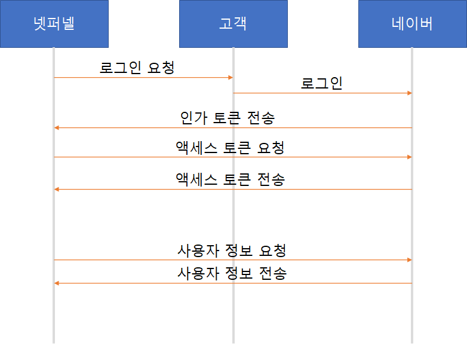
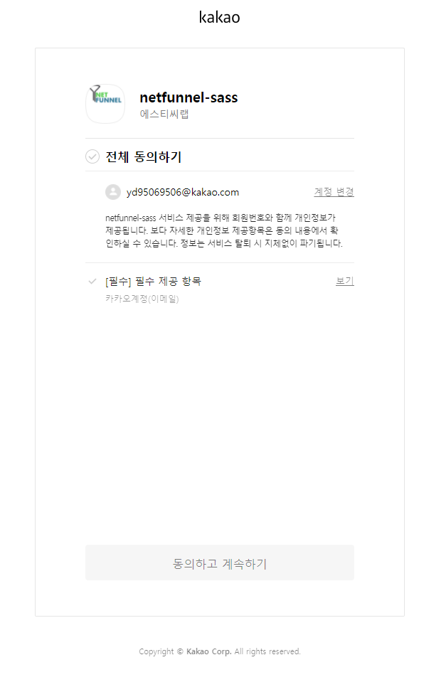
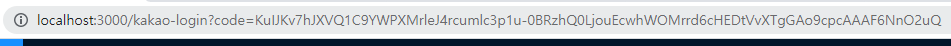
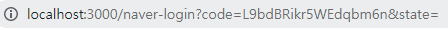
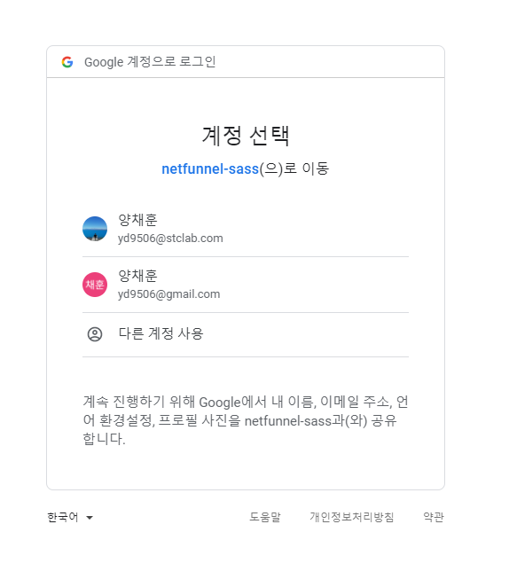
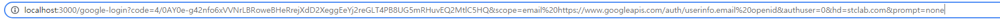

# 소셜 로그인 - 인가 토큰 받아오기

OAuth 2.0을 사용해 소셜 로그인을 할 때의 장점은 우리의 서비스가 가지고 있는 사용자 정보를 최소화 할 수 있는 데에 있습니다. 사용자가 우리 제품이 아닌, 네이버, 카카오, 구글 등에 로그인하여 우리의 서비스를 사용할 수 있고, 이 때 우리는 사용자의 정보 중 필요한 부분(이메일, 이름, 프로필 사진 등)을 네이버, 카카오, 구글에게 요청해 받아옵니다.

## OAuth 2.0 구조

OAuth 2.0의 구조는 간단합니다. 사용자가 우리 제품의 소셜 로그인 버튼을 클릭하여 해당 사이트에 로그인 할 경우 `인가 토큰` 이 발행 됩니다. 우리는 이 인가 토큰을 다시 소셜로 전송해 `액세스 토큰` 을 받을 수 있습니다. 이 액세스 토큰으로 우리는 사용자의 정보를 요청하고 받을 수 있습니다.

제품과 고객과의 통신은 처음 로그인을 요청하는 부분 뿐이고, 로그인은 네이버에서 진행되므로, 사실상 고객에게 정보를 요구하는 부분이 존재하지 않습니다.

## 인가 토큰 받기

인가 토큰은 소셜에게 redirect uri 정보를 사전에 등록하고, 이를 요청하면, 해당 uri에서 인가 토큰을 받을 수 있습니다.

### 카카오

`https://kauth.kakao.com/oauth/authorize?response_type=code&client_id=${클라이언트아이디}&redirect_uri=${Redirect URI}`

response_type은 code 로 고정이고, client_id, redirect_uri를 받습니다.

위의 경로로 이동하면 아래와 같은 내용을 볼 수 있습니다.

전체 동의를 하고, 계속하기 버튼을 클릭하면 위의 Redirect URI의 위치에서 인가 코드를 받아볼 수 있습니다. 

code= 뒤의 부분이 사용자의 로그인을 통해 받은 인가 토큰입니다. 이를 사용해서 액세스 토큰을 발급 받을 수 있습니다.

### 네이버

네이버도 카카오와 거의 똑같습니다.

`https://nid.naver.com/oauth2.0/authorize?client_id={클라이언트아이디}&redirect_uri={Redirect URI}&response_type=code`

역시 response_type은 code로 고정이고 redirect_uri와 client_id를 받습니다.

위의 경로로 접속하면 아래 사진과 같은 화면을 볼 수 있습니다.

여기서 동의하기 버튼을 클릭하면 Redirect URI의 위치에서 인가 토큰을 받을 수 있습니다.

카카오와 같이 code= 뒤의 부분이 인가 토큰입니다. 이를 사용해서 액세스 토큰을 발급 받을 수 있습니다.

### 구글

구글은 처음 전송하는 부분에서 카카오와 네이버랑은 조금 차이가 있습니다. 카카오와 네이버는 response type, client id, redirect uri를 받았다면, 구글은 추가로 scope을 받습니다.

`https://accounts.google.com/o/oauth2/v2/auth?response_type=code&scope=openid%20email&client_id=${클라이언트아이디}&redirect_uri=${Redirect URI}`

위의 경로로 접속하면 아래 사진과 같은 화면을 볼 수 있습니다.

여기서 로그인하려는 계정을 클릭하면 Rect URI의 위치에서 인가 토큰을 받을 수 있습니다.

역시 code= 뒷 부분이 인가 토큰이고, 추가로 scope과 authuser, hd, prompt의 정보를 확인할 수 있습니다.

