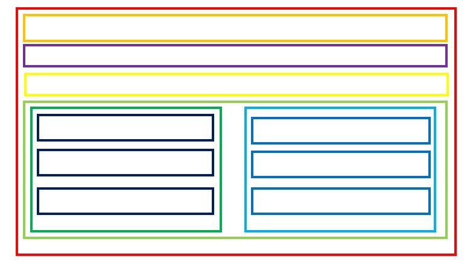
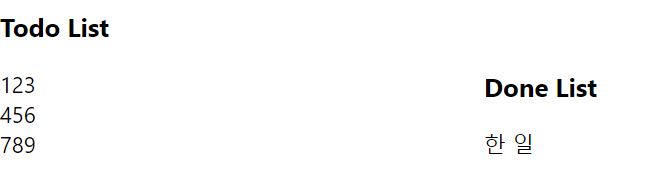
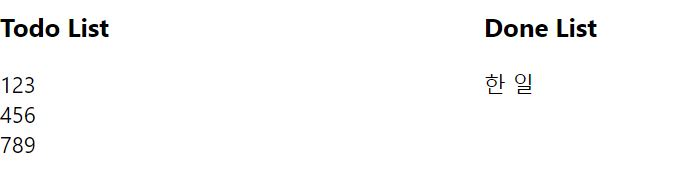

# TIL

하루하루 공부한 것을 적어봅시다.

## 2021.01.30 - 2021.03.05

### 엘리의 드림코딩으로 javascript ES6 기본기 공부

- <a href="./javascript/자바스크립트의역사.md">자바스크립트의 역사</a>
- <a href="./javascript/async와difer.md">async와 difer</a>
- <a href="./javascript/데이터타입과let,var,hoisting.md">데이터 타입과 호이스팅</a>
- <a href="./javascript/operator,if,for.md">연산자와 조건문 및 반복문</a>
- <a href="./javascript/function.md">함수</a>
- <a href="./javascript/class.md">클래스</a>
- <a href="./javascript/object.md">객체</a>
- <a href="./javascript/array.md">배열</a>
- <a href="./javascript/json.md">JSON</a>
- <a href="./javascript/callback.md">콜백함수</a>
- <a href="./javascript/promise.md">Promise</a>
- <a href="./javascript/async.md">async와 await</a>

### CodeComplete 책

- <a href="./Book/CodeComplete/Chapter4.md">4장 구현 시 결정해야 할 핵심 사항</a>
- <a href="./Book/CodeComplete/Chapter5.md">5장 구현 설계</a>
- <a href="./Book/CodeComplete/Chapter6.md">6장 클래스 다루기</a>
- <a href="./Book/CodeComplete/Chapter7.md">7장 고급 루틴</a>
- <a href="./Book/CodeComplete/Chapter8.md">8장 방어적 프로그래밍</a>
- <a href="./Book/CodeComplete/Chapter9.md">9장 의사코드 프로그래밍 프로세스</a>
- <a href="./Book/CodeComplete/Chapter10.md">10장 변수 사용 시 고려할 사항</a>
- <a href="./Book/CodeComplete/Chapter11.md">11장 변수 이름의 기능</a>
- <a href="./Book/CodeComplete/Chapter12.md">12장 기본 데이터형</a>
- <a href="./Book/CodeComplete/Chapter13.md">13장 특이한 데이터형</a>
- <a href="./Book/CodeComplete/Chapter14.md">14장 순차적 코드 구성하기</a>
- <a href="./Book/CodeComplete/Chapter15.md">15장 조건문 사용</a>
- <a href="./Book/CodeComplete/Chapter16.md">16장 반복문 제어</a>
- <a href="./Book/CodeComplete/Chapter17.md">17장 특이한 제어구조</a>
- <a href="./Book/CodeComplete/Chapter18.md">18장 테이블 활용 기법</a>
- <a href="./Book/CodeComplete/Chapter19.md">19장 제어와 관련된 일반적인 이슈</a>

### React

#### Docs 개념 보며 따라하기

- <a href="./react/Docs/helloworld.md">Hello world</a>
- <a href="./react/Docs/JSX.md">JSX</a>
- <a href="./react/Docs/엘리먼트렌더링.md">엘리먼트 렌더링</a>
- <a href="./react/Docs/Component와 Props.md">Component와 Props</a>
- <a href="./react/Docs/State and Lifecycle.md">State와 생명주기</a>
- <a href="./react/Docs/이벤트 처리하기.md">이벤트 처리하기</a>
- <a href="./react/Docs/조건부렌더링.md">조건부 렌더링</a>
- <a href="./react/Docs/리스트와 key.md">리스트와 키</a>
- <a href="./react/Docs/폼.md">Form</a>
- <a href="./react/Docs/State 끌어올리기.md">State 끌어올리기</a>
- <a href="./react/Docs/합성(Composition) vs 상속(Inheritance).md">합성 vs 상속</a>
- <a href="./react/Docs/React로 사고하기.md">리액트로 사고하기</a>

#### Tutorial

- <a href="./react/Tutorial/튜토리얼.md">튜토리얼 추가기능 구현하기</a>

<hr>

## 2021.03.06

**<a href="./Book/CodeComplete/Chapter20.md">코드 컴플리트 20장 소프트웨어 품질</a>**

소프트웨어 품질 보증 활동은 제품 생산 전 과정에 걸쳐서 중요함
제품 생산 과정 중 오류를 찾아 수정하는 시간이 가장 길기 때문에 이 시간을 줄이는 것이 제품 생산 비용을 낮추는데 큰 역할을 하고, 품질 보증 활동은 이 부분에 특히 효과적임

**OKKYCON 2021: 협력의 기술**

팀원들의 커뮤니케이션 능력을 향상시키기 위해서는, 그리고 팀에 좋은 개발 문화를 정착시키기 위해서는 자신의 의견이 무시되거나, 놀림거리 또는 질책의 대상이 되지 않을 것이라는 심리적 안정감을 주는 것이 중요하다.

라인에서 오신 분이 API 자동화에 대해 강의하신 내용은 다시보기로 한번 더 봐야겠다.

**Momentum 클론코딩 시작**

<hr>

## 2021.03.07

**<a href="./Book/CodeComplete/Chapter21.md">코드 컴플리트 21장 협력 구현</a>**

정밀 검토 또는 짝 프로그래밍을 할 경우 소프트웨어의 품질을 향상시킬 수 있고, 시니어 개발자의 경험과 스킬을 주니어 개발자에게 전달해 줄 수 있다. 이를 통해 팀 전체의 생산성 향상도 기대할 수 있다.

**Momentum Time 컴포넌트 수정**

<hr>

## 2021.03.08

**Momentum Component 구조**



컴포넌트 이름

- 빨강: Mementum
- 주황: Weather
- 보라: Time
- 노랑: SearchBar
- 연두: Lists
- 초록: TodoList
- 남색: Todo
- 하늘: DoneList
- 파랑: Done

이렇게 컴포넌트가 구성되어 있다(보라가 중간에 껴있는 것은 이해 바람).

**Momentum SearchBox input 값 상위 컴포넌트로 올리기**

SearchBox 컴포넌트 내의 input 값을 Momentum 컴포넌트에서 관리할 수 있도록 SearchBox와 Momentum 컴포넌트 모두 class형 컴포넌트로 수정.
Momentum 컴포넌트에서 SearchBox의 input 값을 받는 inputValue state를 생성하였고, input의 값을 전달하기 위해 SearchBox에서도 value state를 생성.
SearchBox 컴포넌트에서 폼을 생성해 Submit을 할 수 있도록 하였고, submit 할 경우 input의 값을 빈 값으로 초기화.

<hr>

## 2021.03.09

**JS Number.toFixed()**

Number 객체의 toFixed 메서드는 지정한 값 만큼의 소수점만 보여줌.

사용법

```javascript
const str = Number(10.565).toFixed(2);
console.log(str); // 10.56
```

toFixed 메서드를 사용해 소수점 둘째 자리 까지만 보이도록 설정한 값을 출력하면 10.565가 10.56으로 출력되고, str의 타입은 string이다.

**JS Form submit 이벤트 발생 시 자식 노드에 접근하기**

form submit 이벤트만으로 자식 노드인 input의 값에 접근하기 위해서는 이벤트 핸들러에서 `event.target.childNodes[0].value`로 접근하면 된다.

자식의 수에 따라 childNodes의 번호는 바뀔 수 있고, event.target은 form 그 자체를 가리킨다.

**Momentum TodoList 생성**

사용자로부터 받은 입력으로 하나씩 추가해가는 배열을 state로 설정하고, 이 값을 TodoList 컴포넌트에 전달

<hr>

## 2021.03.10

**CSS display inline-block과 float left**

두 개의 높이가 다른 div를 `display: inline-block`으로 설정할 경우



`float: left`로 설정할 경우



두 사진을 비교해보면 inline-block의 경우 아래가 서로 맞춰지고, float left의 경우 위가 서로 맞춰지는 것을 볼 수 있다. 위를 맞출지, 아래를 맞출지를 기준으로 두 가지를 나눠 사용하면 될 것 같다.

**Momentum TodoList, DoneList 컴포넌트 상하 -> 좌우로 보이도록 css 설정**

<hr>

### 2021.03.11

**window.print()로 페이지 인쇄시 차트 테이블 잘리는 문제 해결 방안**

css 속성에 `break-inside`를 추가해주면 되는데 나는 아래와 같이 해결했다.

```css
.pageBreak {
  break-inside: avoid;
  break-after: auto;
}
```

위의 속성을 주면 페이지 하단에서 내용이 잘리는 경우 자동으로 아래 페이지에서 출력하도록 지원해준다.

**CSS: break-inside**

인쇄시 페이지가 잘리는 break point는 이전 element의 `break-after`, 다음 element의 `break-before`, 현재 속한 container의 `break-inside`의 값에 영향을 받는다.

break의 우선 순위는 먼저 등장한 것 우선이다. 한 element 내에서는 `break-before` > `break-inside` > `break-after` 순으로 우선 순위가 적용된다.

break-inside가 가질 수 있는 properties

- `auto`
  - default 값으로, break를 허용할 수도 있고, 허용하지 않을 수도 있음.
- `avoid`
  - 어느 종류의 break든 이를 최대한 피함
- `avoid-page`
  - page break를 최대한 피함
- avoid-column
  - column break를 최대한 피함
- avoid-region
  - region break를 최대한 피함

또한 `break-inside`는 이전 `page-break-inside`와의 호환성을 보장

**git rebase**

Git에서 branch를 병합하는 방법은 merge와 rebase가 있는데 merge의 경우 안전하고, 쉽다. 그냥 `git merge hotfix`처럼 입력하면 충돌이 생기면 충돌이 생겼다고 알려주고, 충돌이 없을 경우 완전히 merge 된다. 하지만 한 branch에서 여러 개의 커밋을 한 개로 묶고 싶을 경우 merge로는 이를 할 수 없다(내가 알기로는).

여기서 도움이 되는 것이 `git rebase`다. rebase를 하면 합치고 싶은만큼 커밋을 합쳐서 하나로 만들고, 이를 병합하려는 branch의 head에 가져다 놓을 수 있다.

```bash
$ git checkout hotfix
$ git rebase -i @~5     // 최근 5개의 커밋을 합침
```

위를 실행하면 아래와 같은 창을 볼 수 있을 것이다.

```bash
pick a03c578 initial commit
pick d587ff3 헤더 수정
pick f3f5f1f hotfix 수정
pick c30397a 테스트
pick e795cd1 완료

# Rebase a03c578..e795cd1 onto a03c578
#
# Commands:
#  p, pick = use commit
#  r, reword = use commit, but edit the commit message
#  e, edit = use commit, but stop for amending
#  s, squash = use commit, but meld into previous commit
#  f, fixup = like "squash", but discard this commit's log message
#  x, exec = run command (the rest of the line) using shell
#
# These lines can be re-ordered; they are executed from top to bottom.
#
# If you remove a line here THAT COMMIT WILL BE LOST.
#
# However, if you remove everything, the rebase will be aborted.
#
# Note that empty commits are commented out
```

위는 vi로 열리는데 가장 위의 initial commit의 pick은 고정이고, 아래부터 pick을 하단의 커맨드 중 원하는 것으로 바꿔주면 되는데, 커밋을 하나로 합치고 싶은 경우라면 s로 바꿔주면 된다.

이후 `:wq`로 나가면 또 한번 vi가 열린다.

```bash
# This is a combination of 5 commits.
# The first commit's message is:
initial commit

# This is the 2nd commit message:

헤더 수정

# This is the 3rd commit message:

hotfix 수정

# This is the 4th commit message:

테스트

# this is the 5th commit message:

완료

```

여기서는 이제 자기가 원하는 커밋 메시지를 작성하면 되는데 `dd` 명령을 사용하면 한 줄을 삭제할 수 있다.

이제 이후 master branch로 checkout 한 다음, merge를 진행하면 5개의 커밋 메시지가 삽입되는 대신, 한 개의 커밋 메시지가 삽입된다.

<hr>

## 2021.03.12

### Docker 현재 컨테이너 상태 원격에 푸시하기

**Docker 컨테이너 커밋하기**

`docker commit {CONTAINER} {IMAGE}` 명령을 사용해 컨테이너의 상태를 이미지로 커밋할 수 있다.

```bash
$ docker commit myContainer centos7
```

**Docker 이미지 푸시하기**

현재 이미지를 원격 저장소에 올리기 위해서는 푸시를 해야한다.

1. `docker login`으로 일단 도커에 로그인 한다.
2. `docker tag {IMAGE} {TAG}`로 이미지에 태그를 단다.
3. `docker push {TAG}`로 푸시를 한다.

```bash
$ docker login
$ docker tag centos7 chamy/centos7
$ docker push chamy/centos7
```

현재 컨테이너의 상태를 원격 저장소에 푸시하기 위해서는 크게 3개의 단계를 거친다.

1. 컨테이너의 상태를 이미지로 커밋
2. 이미지에 태그 달기
3. 태그단 이미지를 푸시

**JS Array.filter 메서드**

JS에서 Array.filter 메서드를 사용하면 배열에서 원하는 조건만 출력할 수 있음

```javascript
const array = [0, 1, 2, 3, 4, 5];

const even = array.filter(value = > value % 2 === 0);

console.log(even);
```

위처럼 사용하면 array의 요소 중 2로 나눴을 때 나머지가 0인 값들만 걸러지고, 걸러진 배열을 출력하므로 [0, 2, 4]가 출력된다.

정리하면, filter를 사용하면 콜백 함수가 호출되고, 콜백함수로 전달되는 값은 배열의 각 원소들이다. 그리고 콜백 함수가 리턴하는 값을 배열 형태로 반환한다.

**Momenum Todo 클릭시 삭제 기능 추가**

<hr>

## 2021.03.13

**<a href="./Book/CodeComplete/Chpater22.md">코드 컴플리트 22장 개발자 테스트</a>**

테스트 주도 개발(TDD)의 장점에 대해 알게 되었다. 그동안 TDD에 관심이 그렇게 크지 않았는데 여기에 대해 공부해보고 싶은 마음이 생겼고, 개인적으로 테스트 기록을 남겨 이후에 참고할 수 있도록 해야겠다.

**Mometum TodoList에 존재하는 항목 추가시 이미 존재합니다 메시지 출력 기능 구현**

입력으로 받은 값이 todoList state 배열에 존재하는지 Array.indexOf 메서드를 사용해 판단하고, 존재하지 않을 경우 배열에 추가하고, 존재할 경우 추가하지 않고, 화면에 경고 메시지를 띄우도록 함.

```javascript
handleSubmit(value) {
  const todoList = this.state.todoList;

  if (todoList.indexOf(value) === -1) {
    todoList.push(value);
    this.setState({
      inputValue: value,
      todoList: todoList,
      alreadyExist: false
    });
  } else {
    this.setState({
      alreadyExist: true
    });
  }
}
```

<hr>

## 2021.03.14

**<a href="./Book/CodeComplete/Chapter23.md">코드 컴플리트 23장 디버깅</a>**

그동안 console.log로만 디버깅해왔던 내 자신을 반성하게 된다. 오류가 발생하게 된 원인을 명확히 찾고, 프로그램을 이해한 후 결함을 수정할 수 있는 개발자가 되어야겠다.

**JS Drag and Drop**

드래그를 위해서는 드래그 하려는 태그에 draggable="true" 속성을 주어야 하고, ondragstart와 ondrag 이벤트 핸들러를 작성해야 한다.

드랍을 위해서는 드랍을 하려는 태그에 droppable="true" 속성을 주어야 하고, ondrop과 ondropover 이벤트 핸들러를 작성해야 하는데, 이 부분은 조금 더 공부한 후 정리해서 올려야겠다.

<hr>

## 2021.03.15

**Momentum Todo 컴포넌트에 드래그 기능 추가**

<hr>

## 2021.03.16

**JS window.open**

JS에서 `wondow.open(URL)`을 입력하면 URL 주소의 새 창을 띄운다. 이때 한 번 더 `window.open(URL)`로 이전과 같은 URL을 띄울 때는 새 창이 뜨지 않고, 이전의 창이 다시 나타난다(창이 2개가 아니라 1개라는 뜻).

```javascript
const url = "https://tistory.com";
window.open(url);
window.open(url);
```

만약 같은 URL로 여러 개의 새 window를 띄우고 싶다면, 두 번째 파라미터인 name을 설정해주면 된다.

```javascript
const url = "https://tistory.com";
window.open(url, 1);
window.open(url, 2);
```

위 처럼 두번째 파라미터에 다른 값을 입력하면 다른 창이 뜨고, 만약 `window.open(url, 1)`을 한번 더 실행할 경우에는 기존에 떠있던 1번 창이 위로 보여지게 된다.

**Momentum Todo 항목 Done List로 이동시키는 기능 추가**

Drag and Drop을 사용해 Todo 항목을 Done List로 이동시키는 기능을 추가했다. TodoList 컴포넌트에 dragStart 이벤트를 추가하고, DoneList 컴포넌트에 onDrop 이벤트를 추가하고, onDragOver를 동작 중지시켜 구현했다.

Todo 컴포넌트 요소들은 각각 자기의 이름을 id로 가지고 있고, 이는 어떤 항목을 드래그했는지 알게하기 위함이다.

드래그를 시작할 때 dragStart 이벤트가 발생하고, 여기에 `event.dataTransfer.setData('targetId')`를 설정해, 드래그 이벤트가 진행되는 동안 어떤 id를 드래그 중인지 설정해 놓는다. 이후 onDrop 이벤트가 발생하게 되면 해당 이벤트 핸들러에서는 `event.dataTransfer.getData('targetId')`를 통해 드래그 된 항목의 id를 가져온 후 이를 처리한다.

Done List에 항목을 이동시켰으면 Todo List에서는 빼야한다. 이를 처리하기 위해 removeTodo 메서드를 DoneList 컴포넌트에도 전달해 onDrop 이벤트 핸들러에서 이를 처리하도록 했다.

**React 클래스형 컴포넌트 내의 메서드에서 this를 사용한다면 생성자에 꼭 this 바인딩을 해주자**

클래스형 컴포넌트 내의 메서드에서 props나 state를 사용할 때는 this를 사용하는데, 이때 생성자에서 this를 바인딩 해주지 않으면 에러가 발생한다.

<hr>

## 2021.03.17

**Momentum material UI 추가**

```bash
// material-ui 설치
$ npm install @material-ui/core

// material-ui 적용
$ yarn add @material-ui/core

// 애플리케이션 패키지 재설치
$ npm install
```

세 단계를 거쳐 현재 Momentum 앱에 material-ui를 등록했고, 테스트 결과 버튼을 무난히 띄울 수 있었다.

현재 문제는 input 태그에 material-ui를 적용하면 이벤트 핸들러를 어떻게 작성해야 하는가다. 이번 주 남은 기간은 material-ui를 배우고 삽질하는데 많은 시간이 쓰일 것 같다.

<hr>

## 2021.03.18

**CSS에서 클릭 이벤트 제거**

만약 클릭 이벤트를 CSS에서 제거하고 싶을 때는 `point-events: none`을 주면 된다.

**<a href="/react/Experience/state_undefined.md">React state를 생성할 때 undefined일 경우</a>**

상의 컴포넌트로부터 props로 받은 값이 undefined 값이고, 이를 state로 선언할 경우 해당 state는 생성되지 않는다.

**Momentum material UI에 이벤트 핸들러 등록**

<hr>

## 2021.03.19

**Momentum TodoList, DoneList CSS 적용**

<hr>

## 2021.03.20

**Momentum 배경 사진 API 적용**

**웹 페이지에 px을 사용하지 말자**

<hr>

## 2021.03.21

**JS 위도 경도 가져오기**

```javascript
navigator.geolocation((position) => {
  const latitude = position.coords.latitude;
  const longitude = position.coords.longitude;
});
```

navigator의 geolocation 메서드를 사용하면 위도와 경도 정보를 가져올 수 있음

<hr>

## 2021.03.22

**JS 위도 경도로 카카오 API 사용해 현재 위치 표시하기 - 실패**

unauthrized 메시지를 리턴 받는데, 키를 제 위치에 넣지 못한 것 같다. 내일 다시 시도해보고, 사용법을 정리해서 올려야겠다(생각보다 친절히 설명된 것을 찾기 힘듬).

<hr>

## 2021.03.23

**크롬 모달 scrollIntoView 이슈**

오늘 테이블을 클릭하면 해당 차트로 스크롤이 이동하는 동작을 만드는 작업을 하던 중 scrollIntoView 사용시 body와 모달이 동시에 스크롤되는 현상이 발생했다. 모달만 스크롤되고 body만 스크롤 하기 위해서 body에서 스크롤 이벤트가 발생하면, `scrollTop(0)`을 사용해 스크롤 이벤트를 막고 모달만 스크롤 되도록 설정했다.

여기서 크롬에서는 동작하지 않고, 파이어폭스에서는 동작하는 것이

```javascript
$("#element").scrollIntoView({ behavior: "smooth" });
```

위의 코드였다. `behavior smooth`속성을 주면 파이어폭스에서는 body는 스크롤되지 않고, 모달만 스크롤되지만, 크롬에서는 body와 모달 모두 스크롤되지 않는다. 그래서 behaivor 속성을 없애고 실행하면 파이어폭스와 크롬 모두 body는 스크롤되지 않고, 모달만 스크롤된다.

이번 이슈를 해결하면서 내린 결론은 크롬에서 scrollIntoView를 실행할 때 smooth 속성을 준다면 부모 -> 자식으로 가면서 동작이 성공해야 다음 동작이 진행되는 것을 알게되었다. 실제로 `$('body').scrollTop(0)`을 주지 않고, smooth 속성의 scrollIntoView 이벤트를 발생시켰을 때, body가 먼저 스크롤 된 후 모달이 스크롤된다.

**CSS body 스크롤 막는 방법과 한계**

CSS 설정으로 body의 스크롤을 막을 수 있다.

```css
body {
  height: 100%;
  overflow: hidden;
}
```

위처럼 height를 100%, overflow를 hidden으로 설정하면 body에서 스크롤을 할 수 없다.

하지만 scrollIntoView와 같은 다른 스크롤 이벤트로는 body가 스크롤되는데, 여기서 근본적인 문제는 body 내부에 body보다 더 긴 컴포넌트가 있을 때 스크롤이 된다. body 내부의 모든 컴포넌트가 body보다 작으면 당연히 스크롤될 것이 없기 때문에 scroll 되지 않는데, body 내부가 body보다 길어지면 문제가 발생한다.

<hr>

## 2021.03.24

**모멘텀 Kakao 로컬 API를 사용해 현재 위치 화면에 뿌리기**

그저께 실패한 이유가 로컬 API를 사용할 때는 REST API 키를 사용해야 하는데, 나는 Javascript 키를 사용해서 인증 에러가 났었다.

fetch를 사용해 카카오 api로 보내는 형태는 아래와 같다.

```javascript
fetch(`https://dapi.kakao.com/v2/local/geo/coord2regioncode.json?input_coord=WGS84&output_coord=WGS84&y=${latitude}&x=${longitude}`, {
  headers: {
    Authorization: `KakaoAK ${REST API Key}`
  }
});
```

위를 보내면 응답을 성공했다는 메시지를 받게 되는데, 이를 `json()`을 거쳐야 원하는 json 데이터를 얻을 수 있다. 방법은 아래와 같다.

```javascript
fetch("...").then(response.json()).then(console.log);
```

마지막 then에서 받은 값을 위치 데이터로 사용할 수 있다. 나는 위치 정보를 함수 컴포넌트에서 뿌리려고 했는데, 함수형 컴포넌트 내에서는 값의 변화를 외부 props로 받아야 하기 때문에 초기값인 '위치를 찾을수 없습니다' 에서 fetch를 통해 비동기적으로 통신을 완료했을 때 화면에 렌더링하는 loc 변수에는 현재 주소가 있지만 실제로 화면에 렌더링 되지는 않는 문제가 발생했다.

이 문제를 해결하기 위해서 날씨 컴포넌트를 클래스형 컴포넌트로 바꾸고, loc을 state로 관리하도록 했다. 그리고 `componentDidMount`를 사용해 컴포넌트가 렌더링 될 때, API 통신을 하고, 결과를 loc state에 반영했다.

<hr>

## 2021.03.25

**원티드 [성장하는 프론트엔드 개발자 되기] 참석**

> 성장하기 위한 좋은 방법 중 하나는 오픈 소스를 분석하는 것이다.

오픈 소스를 사용은 하지만, 분석해 본 적이 없었다. 그냥 어려울 것 같다는 느낌? 그런데 오늘 이야기를 들어보니 그렇게 어려운게 아닐지도 모른다는 생각이 들었다. 정말 뛰어난 개발자들이 좋은 설계를 적용한 코드를 볼 수 있고, 라이브러리 같은 것들은 규모가 그렇게 크지도 않기 때문에 당장 시작하고 싶은 마음이 생겼다.

**이미지 base64 인코딩**

오늘 이미지 파일을 base64로 인코딩해서 사용하는 것을 해봤는데 그냥 글자가 이미지 그 자체라는게 신기했다. 그 글자들을 웹 주소창에 치면 진짜 그 이미지가 나온다. 원리에 대해 좀 더 공부하고 싶어졌다.

<hr>

## 2021.03.26

**크롬에서 window.open resizable**

크롬에서 윈도우 창을 새로 열 때 resizable은 동작하지 않는다. Only IE 라고 되어있는 것으로 보아 인터넷 익스플로어에서만 동작하는 것 같다.

**모멘텀 todo, done 항목에 hover css 추가**

CSS의 hover를 사용해 마우스를 todo와 done 위에 두면 배경 색이 변하고, 커서도 손가락으로 변하는 기능 추가

<hr>

## 2021.03.27

**<a href="./Book/CodeComplete/Chapter24.md">코드 컴플리트 24장 리팩터링</a>**

리팩터링은 유지보수 단계에서만 하는 것이 아니다. 오히려 릴리즈 하기 전이 리팩터링하기 더 좋은 타이밍이다. 지금 내가 잡은 코드보다 더 나은 품질을 갖도록 하는 것이 리팩터링이다. 단순히 코드를 변경하는 것이 리팩터링이 아니다!

**모멘텀 CSS 개선**

일단 TodoList 컴포넌트와 DoneList 컴포넌트에 중복적으로 적용되는 css가 있어서 이 둘의 클래스를 `list todoList`와 `list doneList`로 바꾸고, 중복 적용 사항은 `.list`에서 정의하고, 별도 적용 사항은 `.list.todoList`와 `.list.doneList`에서 적용했다. 또한 Todo 컴포넌트와 Done 컴포넌트 역시 현재 동일한 css를 중복해서 적용하고 있어서 content 클래스로 묶어서 해당 클래스로 css를 적용했다.

모멘텀의 날씨 컴포넌트에 `text-align: right`을 줘서 화면의 오른쪽에 표시하도록 했고, 기존 px 단위 표현을 rem으로 변경했다.

Input materia ui 컴포넌트의 width를 100%로 설정하고, 텍스트를 입력할 때 가운데에서 입력되도록 변경했는데, width를 100%로 설정하는 아래처럼 fullWidth=true를 주면 된다.

```javascript
<Input fullWidth={true}>
```

다음으로 text-align을 center로 하는 건데, 이는 inputProps로 style을 넘겨주면 된다.

```javascript
<Input inputProps={{style: {textAlign: 'center'}}}>
```

우리가 사용하는 Input 컴포넌트는 div 안에 input 태그가 들어간건데, 위처럼 style을 전달하면 div 내부의 input 태그의 스타일에 적용된다. div에는 전달되지 않으므로, 여기에 width를 아무리 바꿔도 width가 변경되지 않는다(div 내부에 속해있으므로, div의 width를 먼저 바꿔야 함).

<hr>

## 2021.03.28

**코드 컴플리트 25장 코드 튜닝 전략**

다음 장을 읽어봐야 하겠지만, 코드 튜닝은 나에게는 조금 먼 이야기라고 느껴졌다. "아직 동작을 구현하기도 조금 벅찬데 효율성을 위해서 지금 코드를 보기는 어렵지만 더 효율적인 코드로 바꿔야할 수 있을까?" 라는 생각이 든다.

이 장에서는 코드 튜닝이 항상 더 좋은 코드는 아니고, 코드 튜닝보다 컴파일러 및 하드웨어를 교체하거나, 설계 부분에서 문제를 찾는 것이 더 효율적일 수 있다고 한다. 다음 장에서 코드 튜닝 방법에 대해 조금 더 읽어보고 적용할 수 있는 문제인지 확인해야겠다.

<hr>

## 2021.03.29

**CSS position absolute와 부모와의 관계**

개체의 위치를 div 태그 내의 가운데에 고정시키기 위해서 `position: absolute`와 `left: 50%`를 사용했는데 내가 원하는 곳이 아니라 전체 화면의 가운데에 위치해서 어떻게 내가 원하는 곳에 위치 시킬 수 있을까에 대해 찾아보다가, absolute가 부모 중 position이 relative, fixed, absolute 중 하나인 경우, 해당 부모 내의 절대 위치가 된다. 그래서 부모 div의 position을 relative로 주고, 해당 div의 자식의 position을 absolute, left를 50% 주면 부모의 가운데에 위치하게 된다.

<hr>

## 2021.03.30

모멘텀 사용자가 시간 표기법을 설정할 수 있는 기능 추가\*\*

<hr>

## 2021.03.31

**CSS flex**

기존 inline-block과 float을 사용하던 부분을 `display: flex`를 사용하면 조금 더 강력하게 화면을 구성할 수 있다는 것을 알게 되었다. 기능이 너무 강력하고 신기해서 나는 3 개의 div를 3등분해서 나눈 후 화면에 보여주고 싶었는데 flex를 사용하면 매우 쉽게 구현할 수 있었다. 조금더 flex와 grid에 대해 공부해보고, 나한테 더 잘 맞는 것을 사용해야겠다.

**모멘텀 CSS flex 적용 및 시간 표기법 설정 UI 수정**

<hr>

## 2021.04.01

**CSS vh**

vh는 view point 기준으로 퍼센트를 준다. 기존에 height 100%로 화면 전부를 채우려면, html, body 부터 시작해서 모든 부모의 높이를 100%로 설정하고 자신의 높이도 100%로 놓아야 화면을 전부 채웠지만, vh를 사용하면 부모의 height을 수정할 필요 없이 자신의 height을 100vh로 설정하면 된다.

```css
.backgroundDiv {
  height: 100vh;
}
```

참고로 vh는 viewpoint 기준 height 비율이다.

**모멘텀 TodoList, DoneList flex로 화면에 표시 및 높이에 vh 적용**

<hr>

## 2021.04.02

**JS IP, 서브넷 마스크 정규식으로 입력 형식 제한하기**

<hr>

## 2021.04.03

**<a href="./Book/CodeComplete/Chapter26.md">코드 컴플리트 26장 코드 튜닝 기법</a>**

여러 가지 코드 튜닝 기법을 배울 수 있었다. 하지만 가장 중요한 점은 코드 튜닝을 한 후 반드시 성능 테스트를 해야한다는 점이다. 또한 코드 튜닝으로 얻을 수 있는 성능과 좋은 코드의 가치를 비교한 후 튜닝 내용을 적용할 지 결정해야 한다.

<hr>

## 2021.04.04

**<a href="./Book/CodeComplete/Chapter27.md">코드 컴플리트 27장 프로그램의 크기가 구현에 미치는 영향</a>**

프로그램의 크기가 커질수록, 프로그램에서 구현활동이 차지하는 비율이 줄어든다. 대신 의사소통이나, 요구 분석, 설계에 드는 노력이 지수적으로 증가한다.

**JS mouseover-mouseenter, mouseleave-mouseout**

mouseover와 mouseenter의 차이점은 자식에게도 이벤트가 유지되는가이다. 중첩된 div 구조가 있을 때, 부모 div에 mouseover를 걸어놓고 마우스를 자식 div에 가져다대면, 부모 div는 여전히 mouseover 상태이다. 하지만 mouseenter의 경우 부모 div에 마우스가 있을 경우 mouseenter 상태이지만, 자식에게 마우스를 가져가면 mouseenter가 해제된다.

mouseleave와 mouseout도 마찬가지이다. 부모 div에 mouseleave를 걸어놓은 상태로 자식 div로 마우스를 가져갔을 때는 mouseleave 이벤트가 발생하지 않는다. 하지만 mouseout의 이벤트를 걸어놓으면, 자식 div로 마우스를 가져다 댔을 때, mouseout 이벤트가 발생한다.

**모멘텀 onMouseOver - onMouseLeave 사용해 이벤트 구성 및 리액트 아이콘 사용**

기존에 onMouseOver 이벤트와 onMouseOut 이벤트를 사용해 이벤트를 구성했더니, 오버 이벤트가 제대로 동작하지 않아서 leave 이벤트로 수정함.

무료로 제공되는 리엑트 아이콘을 사용해 메뉴 표시

<hr>

## 2021.04.05

**모멘텀 material ui 사용해 시간 변환 토글 생성**

material-ui 아이콘 패키지 설치

```bash
$ npm install --save '@material-ui/icons'
```

material-ui 아이콘 적용

```react
import Fab from '@material-ui/core/Fab';
import AddIcon from '@material-ui/icons/Add';
import Switch from '@material-ui/core/Switch';

<Fab size="small" color="secondary" aria-label="add">
	<AddIcon />
</Fab>
<Switch checked="{props.showFullHour}" onChange="{props.changeTimeFormat}" />
```

**모멘텀 5분마다 현재 위치 새로 받아오도록 변경**

<hr>

## 2021.04.06

**모멘텀 아이콘 정렬 및 시간 크기 수정**

<hr>

## 2021.04.07

**CSS word-break**

table td 태그 내부에 span 태그를 사용해 글을 넣을 때, 글이 길어지면 텍스트가 td를 빠져나가는 현상이 발생한다. 이를 막으려면 td 또는 table에 word-break 속성을 주면 된다.

```css
td {
  word-break: break-all;
}
```

내가 미리 정해둔 길이가 되면 텍스트를 하단으로 내린다. 기본 값은 단어별로 하단으로 내리는데, 단어 상관하지 않고, 그냥 내려버린다.

<hr>

## 2021.04.08

**모멘텀 시간 표현 아이콘 position absolute로 수정**

<hr>

## 2021.04.09

**모멘텀 툴팁 생성**

<hr>

## 2021.04.10

**<a href="./Book/CodeComplete/Chapter28.md">코드 컴플리트 28장 구현 관리</a>**

이번 장은 나보다는 관리자 또는 리더들에게 도움이 될만한 내용들이 주를 이뤘다.

**<a href="./css/CSS before와 after.md">CSS before와 after</a>**

어제 툴팁을 css의 after를 사용해 생성했는데, 정확한 기능을 몰라서 오늘 찾아봤다. 화면을 꾸미는데 유용하게 사용할 것이라 생각되고, 회사 프로젝트에서도 이미 before와 after를 사용하고 있는데 게을러서 그동안 찾아보지 않다가 오늘에서야 찾아봤다...

내용은 간단한데, before는 요소에 첫 번째 자식을 추가하는 것이고, after는 마지막 자식을 추가하는 것이다.

<hr>

## 2021.04.11

**<a href="./Book/CodeComplete/Chapter29.md">코드 컴플리트 29장 통합</a>**

이번 장에서는 여러가지 통합 방법에 대해 설명한다. 상향식, 하향식, 샌드위치, 위험지향 통합 등과 같은 방법에 대해 학부 과정에서 배운 내용들을 다시 상기할 수 있는 시간이었고, 어떤 통합을 선택하든지 그 과정에서 일일 빌드와 스모크 테스트가 프로젝트를 성공적으로 마치게 도와주는 방법이라는 것을 알게 되었다.

<hr>

## 2021.04.12

**<a href="./Book/CodeComplete/Chapter30.md">코드 컴플리트 30장 프로그래밍 도구</a>**

이번 장을 읽으면서 "VSCode 만세"라고 속으로 외쳤다. 프로그래밍 도구가 갖춰야할 모든 것을 갖추고 있다고 느껴진다.

### 모멘텀

**컴포넌트 파일로 분리**

기존 index.js에 있던 여러 컴포넌트들을 Momentum 컴포넌트를 제외하고 파일로 분리했다. 해당 컴포넌트 이름을 가진 js 파일을 만들고 파일에서 `export default 컴포넌트이름` 을 사용해 export 해주었고, index.html 파일에서는 `import 컴포넌트이름 from 경로` 로 import해 사용했다.

**기존 카카오 API 사용 개선**

불필요하게 index.html 파일에서 카카오 API를 가져오던 부분을 삭제하고, fetch만을 사용해 현재 지역을 가져오도록 수정

**기존 현재 지역 가져오는 부분 메서드로 만들어 사용**

기존에 카카오 API 사용해 현재 위치를 가져오는 부분을 메서드로 분리했다. 그리고 setInterval이 해당 시간 뒤에 처음 실행되는 것을 해결하기 위해, 먼저 한 번 실행하고, setInterval을 주었다.

**이슈 발생**

`window.navigator.getCurrentLocation`이 크롬과 파이어폭스에서 https가 아니면 지원하지 않는다고 한다. 현재 로컬 react 앱을 https로 변환하는 방법에 대해 연구해야겠다.

<hr>

## 2021.04.13

**모멘텀 https로 연결**

<hr>

## 2021.04.15

어제 회식으로 인해 공부를 못했다. 1일 1커밋이 벌써 끊길 거라고 생각 못했는데 오늘부터 다시 시작하자! 화이팅!

**모멘텀 현재 위치 날씨 표시**

카카오 API를 사용할 때 사용한 위도, 경도 데이터를 날씨 API에도 사용해서 현재 위치 기반 날씨를 받아온다. 근데 같은 위도 경도를 사용했는데 카카오 API에선 내 위치가 도봉구라고 뜨는데, 날씨 API에서는 의정부시라고 뜬다... 도봉구에 기상 관측소가 없나보다.

카카오 API 사용한 것과 똑같이 날씨 API를 사용했고, fetch를 사용해 GET 방식으로 요청하고 데이터를 받아왔다. 

현재 날시를 영문으로 Cloud 이렇게 표시하는데, 내일부터는 이것을 아이콘으로 표현하도록 바꿔야겠다.

<hr>

## 2021.04.16

**모멘텀 맑음, 흐림 아이콘 처리**

현재 날씨가 Cloud, Clear일 경우 아이콘 처리했는데, 다른 날시일 때는 어떻게 데이터를 주는지 모르겠어서 아직 처리를 못했다.

날씨 아이콘 처리가 끝나는대로, 온도를 표시하는 부분을 진행해야겠다.

<hr>

## 2021.04.17

**<a href="./Book/CodeComplete/Chapter31.md">코드 컴플리트 31장 레이아웃과 스타일</a>**

이번 장을 읽으면서 한 번 더 느꼈다. VSCode 고맙다!


### 모멘텀

* Rain 아이콘 추가
* 현재 온도 올림해서 화면에 표시