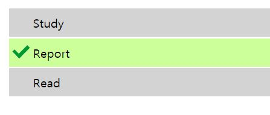

# CSS before와 after

어제 CSS를 사용해 툴팁을 만들면서, ul 태그에 after 속성을 준 후 만들었는데, before와 after가 무슨 역할인지 정확히 몰라서 찾아보게 되었다.

간단히 말하면, before은 해당 엘리먼트의 첫 번째 자식을 만들고, 속성을 주는 것이다. after은 마지막 자식을 만들고 속성을 준다.


## 적용

### 인용구 만들기

q 태그 앞 뒤로 before와 after를 사용해 인용 문구를 추가해봤다.

#### HTML

```html
<q>Hello</q> Chamy said <q>Hi!!</q>
```

#### CSS

```css
q::before {
  content: "«";
  color: blue;
}

q::after {
  content: "»";
  color: red;
}
```


`q::before` 를 보면 content를 사용해 요소 내부에 넣을 값을 주고, 색은 파란색으로 지정해주었다. `q:after` 에서도 마찬가지로 content 요소를 사용해 내부에 넣을 값을 주고, 색은 빨간색으로 지정해주었다. 코드만으로 예측할 수 있다면 거의 이해한 것인데, Hello와 Hi가 아래 사진처럼 파란색과 빨간색의 인용문구로 채워질 것이다.


### 리스트 체크

이번에는 javascript도 사용해서, 완료한 리스트에 체크 표시를 하는 실습을 진행해봤다.

#### HTML

```html
<ul>
    <li>Study</li>
    <li>Report</li>
    <li>Read</li>
</ul>
```

#### JS

```javasc
const list = document.querySelector('ul');
list.addEventListener('click', (event) => {
    if (event.target.tagName === 'LI') {
        event.target.classList.toggle('done');
    }
}, false);
```

#### CSS

```css
li {
  list-style-type: none;
  position: relative;
  margin: 2px;
  padding: 0.5em 0.5em 0.5em 2em;
  background: lightgrey;
  font-family: sans-serif;
}

li.done {
  background: #ccff99;
}

li.done::before {
  content: "";
  position: absolute;
  border-color: #009933;
  border-style: solid;
  border-width: 0 0.3em 0.25em 0;
  height: 1em;
  top: 1.3em;
  left: 0.6em;
  margin-top: -1em;
  transform: rotate(45deg);
  width: 0.5em;
}
```


JS를 사용해 클릭할 경우 done 클래스가 토글되도록 해두고, CSS를 사용해 done에 before를 걸어 앞에 체크 표시가 나타나도록 구현했다.

