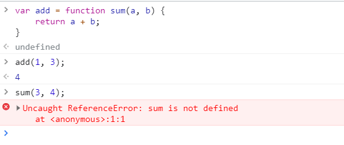
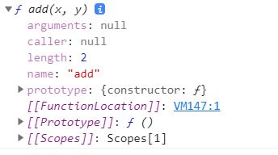
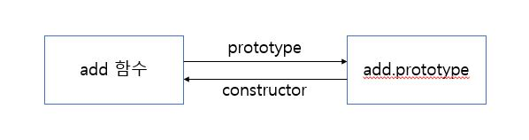
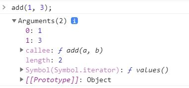

# JS: 함수에 대하여

"인사이드 자바스크립트" 책을 구입해서 읽던 중 4장 제목이 함수와 프로토타입 체이닝인데 몰랐던 부분이 많고, 정리해두면 좋을 것 같아서 글을 쓰게 되었다. 

# 함수 정의

함수는 세 가지 방법으로 정의할 수 있다.

* 함수 선언문
* 함수 표현식
* Function() 생성자 함수

자바스크립트에서는 함수도 객체이다. 그래서 조금 어색하지만 변수에 함수의 레퍼런스를 담을 수 있고, 객체를 리터럴로 생성하듯 함수도 리터럴로 생성할 수 있다.


## 함수 선언문

```javascript
function add(a, b) {
    return a + b;
}
```

위의 코드가 함수 리터럴 방식이자 함수 선언문 방식이다. 사실 리터럴 방식과 함수 선언문은 약간의 차이점이 존재하는데, 리터럴은 함수 이름이 선택사항이다. `add` 라는 이름이 없어도 리터럴 방식이라고 할  수 있다. 하지만 함수 선언문은 반드시 이름이 있어야하고, 만든 이름으로 함수에 접근한다.


## 함수 표현식

```javascript
var add = function (a, b) {
    return a + b;
}
```

정확히 표현하면 여기서 오른쪽 항에 있는 부분이 함수 리터럴이다. 함수 리터럴의 레퍼런스를 `add` 변수에 담아 함수 표현식으로 함수를 생성한다. 함수 리터럴로 만든 함수는 이름이 없기 때문에 익명 함수라고 부르고, `plus = add` 처럼 익명 함수 레퍼런스를 다른 변수에도 담을 수 있다.

위의 예제는 익명함수로 만들었기 때문에 익명 함수 표현식이라고 부른다. 만약 오른쪽 함수 리터럴에 이름을 넣어 줬을 때는 기명 함수 표현식이다. 기명 함수를 사용할 때 주의할 점이 있다.

```javascript
var add = function sum(a, b) {
    return a + b;
}
```

위의 예제에서 만약 두 수를 더할 때 `add` 와 `sum` 중 어떤 것을 사용해야할까? 나는 처음에 둘 다 사용해도 될 줄 알았다. 하지만 `sum(1, 3)` 을 호출하면 아래 사진처럼 에러가 발생한다.



오른쪽에 `sum` 이라는 이름으로 선언된 함수는 외부에서 `sum` 으로 접근이 불가능하다. 그럼 여기서 생기는 의문점은 "이름을 쓸 필요가 없는건가?" 이다. 기명 함수 표현식을 사용할 때는 내부에서 재귀적으로 자기 자신을 호출할 때다. 사실 외부에서만 `sum` 사용이 불가능하고, `sum` 함수 내부에서는 `sum` 으로 접근이 가능하다.

시작 수부터 끝 수까지 모두 더하는 함수는 아래 코드처럼 만들 수 있다.

```javascript
var add = function sum(a, b) {
    if (a === b) {
        return a;
    }
    return a + sum(a + 1, b);
}
```

외부에서는 `sum` 에 접근하지 못하지만, `sum ` 함수 내부에서는 `sum` 에 접근할 수 있다. 이렇게 재귀적인 함수를 생성해야 할 때는 기명함수를 사용해서 내부에서 자신에게 접근할 수 있다.

## Function() 생성자 함수

```javascript
var add = new Function('a', 'b', 'return a + b');
```

이 방법은 자주 사용되는 문법은 아니다. `new Function` 형태로 객체를 생성하는 방식으로 함수를 생성하고(함수도 객체이므로) 가장 마지막엔 동작, 이 전에는 매개변수들이 들어온다.


## 정리

그럼 위의 세 가지 방법 중 가장 좋은 함수 생성법은 무엇일까? 물론 각각의 장단점이 있을 수도 있지만, 함수 호이스팅의 변수를 제거하기 위해서는 함수 표현식을 사용하는 것이 좋다. 함수 선언식의 방식으로 함수를 생성하면 호이스팅이 일어나서 선언하기 전에도 해당 함수에 접근할 수 있다. 하지만 함수 표현식을 사용하게 되면 해당 위치에서 함수가 정의되기 때문에 호이스팅으로 인한 실수를 최소화할 수 있다.

위의 말을 다시 정리하자면, 함수 선언문은 호이스팅 때문에 가장 상단에서 함수의 선언과 초기화가 이루어진다. 하지만 함수 표현식의 경우, 상단에서 변수가 생성되고,  초기화는 되지 않는다. 이후 표현식을 사용한 위치에서 함수가 해당 변수에 할당되는 동작이 이루어지기 때문에, 호이스팅으로 인한 문제를 예방할 수 있다. 함수 표현식의 사용과 실제 예제를 코드로 잠깐 설명하자면 아래와 같다.

```javascript
add(3, 4);	// 에러

var add = function(a, b) {
    return a + b;
}

add(1, 2);	// 3
```

위의 코드에서 첫 번째 사용한 add는 에러를 발생시킨다. "당연히 add 가 밑에 있으니까 에러지!" 라는 대답은 반은 맞고 반은 틀리다. 위의 코드는 브라우저에서 아래와 같이 동작한다.

```javascript
var add;

add(3, 4);

add = function(a, b) {
    return a + b;
}

add(1, 2);
```

`var` 를 사용해 변수(여기서는 함수)를 선언할 때 호이스팅이 발생한다. 따라서 가장 위에 add 변수가 선언된다. 하지만 이 때는 함수의 레퍼런스가 add 에 할당되지 않았기 때문에 첫 번째 add 에서는 에러가 발생하고, 두 번째 add 는 정상적으로 실행된다.


# 함수 객체

위에서도 한 번 언급했는데, 자바스크립트에서 함수는 객체로 취급한다. 따라서 동적으로 프로퍼티들을 생성할 수 있다.

```javascript
function add(a, b) {
    return a + b;
}

add.test = add(1, 2);
add.status = 'OK';

console.log(add.test);		// 3
console.log(add.status);	// 'OK'
```

함수의 코드 `return a + b` 는 add 객체의 [[Code]] 프로퍼티에 자동으로 저장된다. 그리고 `add.test` 나 `add.status` 처럼 동적으로 프로퍼티를 생성하고, 접근할 수 있다.


자바스크립트에서 함수를 객체로 취급하기 때문에 아래의 동작이 모두 가능하다.

* 리터럴에 의해 생성
* 변수나 배열의 요소, 객체의 프로퍼티 등에 할당 가능
* 함수의 인자로 전달 가능
* 함수의 리턴값으로 리턴 가능
* 동적으로 프로퍼티를 생성 및 할당 가능

위의 5 가지 특징이 모두 가능할 경우 자바스크립트에서는 **일급 객체** 라고 부르고, 함수 역시 일급 객체이다. C++ 와 같은 언어에서는 함수를 매개 변수로 전달하는 것이나, 함수를 변수에 할당하는 것이 말도 안된다고 생각할 수도 있는데, 자바스크립트에서는 이러한 기능을 지원함으로써 함수형 프로그래밍이 가능하도록 한다.


## 함수 객체의 기본 프로퍼티

모든 함수는 기본적으로 **length** 와 **prototype** 프로퍼티를 가지고 있다. 



add 함수를 `console.dir` 를 사용해 콘솔에 찍어보면 length 프로퍼티와 prototype 프로퍼티를 기본적을 볼 수 있는데, length 프로퍼티는 매개변수의 수를 의미한다. add 함수는 x 와 y 두 개의 매개변수를 받으므로 length 는 2 이다.

prototype 은 constructor 라는 프로퍼티를 가진 객체인데, 함수의 prototype 의 constructor 는 자기 자신(여기서는 add) 를 가리킨다. 따라서 아래의 그림과 같은 형태를 띈다.



그리고 name 프로퍼티는 함수의 이름을 나타내고, 현재는 함수의 이름을 add 로 줬는데, 익명 함수로 선언할 경우 name 의 값은 null 이 된다. arguments 와 caller 프로퍼티는 함수가 호출될 때 값을 갖게 되는데, arguments 는 함수를 호출할 때 전달된 매개변수 값을 나타내고, caller 는 자신을 호출한 함수를 나타낸다.

**\__proto__** 프로퍼티는 크롬에서 **[[Prototype]]** 으로 표시되는데, 함수의 경우 `Function.prototype` 을 가리킨다. Function.prototype 역시 함수 객체이고, 이 역시 객체이므로 \__proto__ 로 Object 를 가지고 있다. Funtion.prototype 을 편하게 함수 프로토타입으로 부르면, 함수 프로토타입은 Function 함수의 프로토타입이므로 constructor 를 가지고 있다. 이 constructor 는 당연히 Function 객체를 가리키고, 이 Function 객체는 빈 함수이다. 그냥 Function 을 출력해보면 아무것도 없고, length 값은 1이고, Function 이라는 이름만 가지고 있다. 그리고 함수 프로토타입의 경우 apply, arguments, bind, call, caller 등과 같은 함수에서 사용할 수 있는 메서드들을 가지고 있다.


# 함수의 형태

## 콜백 함수

콜백 함수는 코드에서 함수를 명시적으로 호출하는 것이 아니라 특정 이벤트가 발생했을 때 시스템에서 호출하는 함수 또는 특정 함수에서 매개변수로 함수를 받아서 특정 함수 내에서 실행되는 함수를 뜻한다.

## 즉시 실행 함수

정의하자마자 실행되는 함수를 즉시 실행 함수라고 한다. 즉시 실행 함수는 아래 코드처럼 사용할 수 있다.

```javascript
(function(a, b) {
    console.log(a + b);
})(3, 4)	// 7
```

위에서 만든 익명 함수는 처음에 한 번만 실행되고, 이후에 다시 실행할 수가 없다. 이런 특징 때문에 최초 **한 번의 실행만을 필요로 하는 초기화 코드에 사용할 수 있다.** 또한 자바스크립트 라이브러리나 프레임워크의 처음 부분과 끝 부분에서 즉시 실행 함수를 사용하는데, 이는 **변수 유효 범위 특성** 때문이다. 나중에 변수 유효 범위에 대해서 따로 설명할 예정이니 여기서 간단하게만 말하면, 자바스크립트에서는 함수 단위의 변수 유효 범위를 가진다. 기본적으로 가장 바깥쪽에서 변수를 선언하면 모든 곳에서 해당 변수에 접근할 수 있다. 하지만 즉시 실행 함수로 감쌀 경우, 즉시 실행 함수 내부에서만 변수가 유효하기 때문에 바깥쪽에서 내부의 변수에 접근할 수 없다. 이를 통해 라이브러리와 사용자의 자바스크립트 코드를 분리해서, 서로의 변수에 영향을 주지 않도록 할 수 있다.

## 내부 함수

함수 내부에서 정의 된 함수를 내부 함수라고 한다. 내부 함수를 사용해서 그 유명한 클로저를 만들 수 있다. 클로저는 내부 함수와 scope 체이닝과 관련이 있는데, scope 체이닝은 외부 함수의 선언된 변수를 사용할 수 있도록 scope 이 연결되어 있다는 것을 뜻한다. 반대로 외부 함수에서는 내부 함수의 변수에 접근할 수는 없다.

## 함수를 리턴하는 함수

자바스크립트에서는 함수도 객체이므로 함수가 함수를 리턴할 수 있다. 이를 활용해 아래 코드처럼 저신을 재정의하는 함수를 구현할 수 있다.

```javascript
function self = function() {
    console.log('a');
    return function() {
        console.log('b');
    }
}

self = self();	// a
self();			// b
```

self 함수는 처음에 a 를 출력하고, 이후에 자신이 리턴하는 함수로 재정의된다. 그리고 다시 실행하면 이후에는 b 만을 출력한다. 이 역시 즉시 실행 함수처럼 한 번만 실행되는 초기화 코드에 사용될 수 있다.


# 함수 호출과 this

가장 중요한 부분이다. 사실 ES6 에 추가된 화살표 함수를 사용하면 함수가 정의될 때 this 가 정해지므로 헷갈일 일이 별로 없다. 하지만 자유로운 자바스크립트의 특성상 this 또한 자유롭고 싶고, 이를 사용해 재사용성 높은 코드를 만들 수도 있으므로 함수와 this 에 대해서는 정확하게 짚고 넘어가는 것이 좋을 것 같다.

## arguments 객체

함수 객체에서 함수는 기본적으로 arguments 프로퍼티를 가지고 있다고 말했었다. 이는 함수가 호출될 때 인자로 넘겨진 매개변수들의 값을 나타낸다. 

```javascript
function add(a, b) {
    console.dir(arguments);
    return a + b;
}
```

위의 add 함수를 선언하고 실행한 뒤 콘솔에 찍힌 내용을 보면 아래와 같다.



arguments 객체는 유사 배열 객체다. 따라서 length 프로퍼티를 갖고 이는 매개변수의 수를 의미한다. 그리고 0 부터 시작하는 매개변수들의 값을 배열 형태로 가지고 있고, callee 프로퍼티는 현재 실행 중인 함수의 참조값을 갖는다.

**arguments 객체는 아래 코드처럼 매개변수의 수가 정확하게 정해지지 않은 함수를 구현하거나, 매개변수의 수에 따라 다른 처리를 해야할 때 유용하게 사용할 수 있다.**

```javascript
function add() {
    var result = 0;
    for (var i = 0; i < arguments.length; i++) {
        result += arguments[i];
    }
    
    return result;
}
```


## 호출 패턴과 this 바인딩

### 메서드의 this

자바스크립트에서는 함수가 호출될 때 arguments 객체와 this 인자가 함수 내부로 암묵적으로 전달된다. 자바스크립트에서 객체의 프로퍼티로 함수를 가질 수 있다고 했는데, 이러한 함수를 메서드라고 부른다. 메서드에서 this 는 자신을 호출한 객체로 바인딩 된다. 아래 예제를 살펴보면 이해하기 쉽다.

```javascript
var obj1 = {
    name: 'foo',
    sayName: function() {
        console.log(this.name);
    }
}

var obj2 = {
    name: 'bar'
}
obj2.sayName = obj1.sayName;

obj1.sayName();	// foo
obj2.sayName(); // bar
```

sayName 메서드의 this 는 자신을 호출한 객체로 바인딩되므로, `obj1.sayName()` 을 실행하게 되면 sayName 내부의 this 는 자신을 호출한 obj1 로 바인딩 된다. `obj2.sayName()` 의 경우 sayName 을 호출한 객체가 obj2 이므로 sayName 의 this 는 obj2 로 바인딩 된다.


### 일반 함수의 this

메서드가 아닌 일반 함수의 경우는 어디에 바인딩 될까? 자바스크립트 특히 브라우저에서 동작하는 자바스크립트의 경우 window 라는 전역 객체 내부에서 함수나 변수들이 선언되고 실행된다. 그래서 일반적으로 우리가 함수를 선언할 때 window 객체 내에 프로퍼티를 동적으로 생성하는 것과 같다. 따라서 실행할 때도 window 객체 내에서 실행하므로 this 는 window 객체에 바인딩 된다.


### 생성자의 this

생성자 함수에서의 this 는 조금 다르게 동작한다. 이를 이해하기 위해서는 생성자 함수의 동작 순서를 한 번 살펴 보는 것이 좋다.

1. 빈 객체 생성
2. this 를 빈 객체에 바인딩
3. this 를 사용해 내부 프로퍼티 동적 생성
4. 생성된 객체 리턴
   * 기본적으로 this 가 바인딩 된 객체를 반환하지만, 명시적으로 특정 객체를 반환할 경우 해당 객체가 반환된다. 이 때 주의할 점은 반환하는 것이 객체가 아닌 boolean, string, number 와 같은 값을 반환할 경우 기본 값인 this 가 바인딩 된 객체를 반환한다.

생성자 함수는 위의 순서를 거치고, 생성자 함수 내부의 this 는 자신이 반환할 객체에 바인딩된다. 생성자 함수는 아래 코드처럼 생겼다.

```javascript
var Person = function (name) {
    this.name = name;
}

var foo = new Person('foo');
console.log(foo.name);	// foo
```

Person 은 생성자 함수이므로 대문자로 시작하고, 여기서 사용하는 this 는 반환하려는 객체를 가리킨다. 또한 명시적으로 return 값을 정하지 않았기 때문에 this 가 바인딩 된 객체를 반환하고 그 객체는 `{name: foo}` 형태를 가지고 있다. 물론 자바스크립트 객체이므로 \_\_proto\_\_ 프로퍼티를 가지고 있고, 이는 constructor 프로퍼티만 있는 Person 함수의 프로토타입을 가리킨다. 생성자 함수로 생성된 객체와 객체 리터럴 방식으로 생성된 객체의 차이점은 \__proto__ 가 어떤 객체를 가리키냐의 차이다. 생성자 함수로 생성된 객체의 경우 자신을 생성한 함수의 프로토타입(Function.prototype 이 아님) 객체를 가리키고 객체 리터럴 방식으로 생성된 객체의 경우 Object.prototype 객체를 가리킨다.

만약 위의 Person 생성자 함수를 `new` 를 붙이지 않고 사용할 경우 this 는 전역 객체인 window 에 바인딩 되므로, 전역 name 변수가 생성되고, 해당 값에 매개변수로 받은 foo 가 저장된다. 이러한 동작은 의도하지 않은 동작이라서, 이 방법으로 사용하지 않도록 모든 개발자에게 알리고, 사용하지 않아야 되는데 어디서나 실수가 나올 수 있어서, 이에 대한 대책이 필요하다. 아래 코드가 항상 객체를 생성하게 하는 자바스크립트에서 유명한 패턴이다.

```javascript
function A(arg) {
    if (!this instanceof A) {
        return new A(arg);
    }
    this.value = arg ? arg : 0;
}
```

이 패턴을 사용하게 되면 만약 `new` 를 붙이지 않았을 때에도 내부에서 `new` 로 해당 생성자 함수를 다시 호출하기 때문에 항상 생성자 함수로서의 역할을 하게 된다.


## call 과 apply 메서드를 사용한 명시적 this 바인딩

call 과 apply 는 Function.prototype 의 메서드이다. 따라서 모든 함수 객체는 call 과 apply 메서드를 사용할 수 있다. 이 두 메서드의 역할은 함수 내부에서 사용할 this 를 명시적으로 바인딩 시켜주는 역할을 한다.

```javascript
var sayName = function () {
    console.log(this.name);
};

var foo = {
    name: 'foo'
};

sayName();			// 
sayName.apply(foo);	// foo
```

위의 코드에서 첫 번째 sayName 은 전역 window 객체에 name 변수를 정의하지 않았기 때문에 아무것도 출력하지 않는다. 하지만 아래 sayName 의 경우 sayName 내부에서 사용하는 this 를 foo 객체에 바인딩했으므로, foo 를 출력한다. 만약 매개변수가 필요한 함수일 경우 `functionName.apply(obj, [1, 2])` 와 같이 두 번째 인자로 배열을 넘겨서 사용할 수 있다. 객체에 length 프로퍼티가 존재할 경우 유사 배열 객체라고 불렀는데 apply 나 call 을 사용해서 Array.prototype 의 메서드들의 this 를 유사 배열 객체에 바인딩하여 push, pop 등과 같은 배열 메서드를 사용하는 것이 가능하다.


# 정리

함수를 어떻게 정의하는 것이 권장되는 방법인지에 대해 학습할 수 있었던 점과 this 에 대해 이해하고 넘어갔다는 것이 이번 장을 정리하면서 얻은 가장 큰 수확이었다. 자바스크립트에서 오버로드는 불가능하지 않나? 라는 생각을 했었는데, arguments 객체를 사용하면 오버로드와 같은 기능을 충분히 구현할 수 있다는 것을 알게 되었고, 사실 그동안 생성자를 사용하지 않았었는데 이번 기회를 통해 생성자를 사용해 객체를 만들고, 이를 활용하는 방법에 대해서도 고민을 할 수 있게 되었다.
