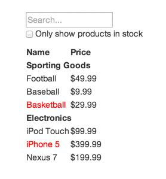
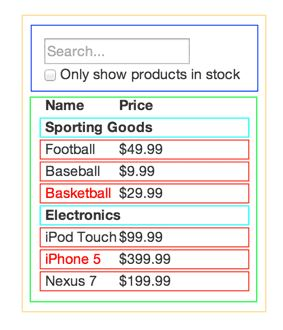
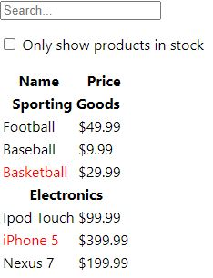
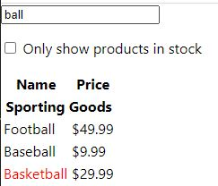
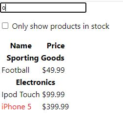

# Reat로 사고하기

> React는 JavaScript로 규모가 크고 빠른 웹 애플리케이션을 만드는 가장 좋은 방법입니다. React는 Facebook과 Instagram을 통해 확장성을 입증했습니다.

React의 가장 쿨한 점은 앱을 설계하는 방식이다. 이번 섹션을 통해 React로 상품들을 검색할 수 있는 데이터 테이블을 만드는 과정을 진행해보자.

<hr />

## 목업으로 시작하기

이 장에서 목업이라고 말하는 것은 나는 학부 과정 중 테스팅 과목을 들으면서 얼핏 배운적이 있다. mock 객체라고 해서 아직 완료하지 못한 경우 이를 테스트하기 위해 mock 객체를 붙여 테스트 한다고 알고 있는데 확실하진 않으니 따로 찾아보고 다시 글을 수정하도록 하겠다.

일단 JSON API와 목업을 디자이너로부터 받았다고 가정해보자.

목업은 아래 사진과 같을 것이다.



JSON API는 아래와 같은 데이터를 반환한다.

```json
[
  {category: 'Sporting Goods', price: '$49.99', stocked: true, name: 'Football'},
  {category: 'Sporting Goods', price: '$9.99', stocked: true, name: 'Baseball'},
  {category: 'Sporting Goods', price: '$29.99', stocked: false, name: 'Basketball'},
  {category: 'Electronics', price: '$99.99', stocked: true, name: 'Ipod Touch'},
  {category: 'Electronics', price: '$399.99', stocked: false, name: 'iPhone 5'},
  {category: 'Electronics', price: '$199.99', stocked: true, name: 'Nexus 7'}
]
```


<hr>

## 1단계: UI를 컴포넌트 계층 구조로 나누기

우리가 할 첫 번째 일은 모든 컴포넌트(와 하위 컴포넌트) 주변에 박스를 그리고, 그 각각에 이름을 붙이는 것이다.

박스를 그릴 때 생각해야 할 점은 "단일 책임 원칙"이다. 한 컴포넌트는 한 가지 일을 하는 것이 이상적이고, 이는 함수, 클래스에도 동일하게 적용된다. 컴포넌트가 크면 작은 하위 컴포넌트로 분리해야 한다.

주로 JSON 데이터를 유저들에게 보여주기 때문에, 데이터 모델만 적절히 만들어지면 UI가 화면에 잘 연결될 것이다.

React의 공식 문서를 보면 친절하게 이를 나눠주었다.



5개의 색깔로 구분된 박스들을 이제 하나하나 살펴보자.

1. FilterableProductTable(노란색): 전체 컴포넌트
2. SearchBar(파란색): 유저의 입력을 받는 컴포넌트
3. ProductTable(연두색): 유저로부터 받은 입력을 기반으로 데이터 콜렉션을 필터링해서 보여줌
4. ProductCategoryRow(하늘색): 각 카테고리의 헤더
5. ProductRow(빨간색): 각 제품의 해당하는 행을 보여줌

이젠 이를 계층 구조로 나타내보자.

* FilterableProductTable
  * SearchBar
  * ProductTable
    * ProductCategoryRow
    * ProductRow

<hr>

## 2단계: React로 정적인 버전 만들기

1단계에서 구조를 짰으니 이제 실제로 구현을 하는 부분이다. 가장 쉬운 방법은 화면에 UI를 렌더링은 하지만, 동작은 하지 않는 정적인 버전을 만드는 것이다. 정적 버전을 만드는 것은 생각은 적게 들고, 타이핑은 많이 드는 과정이다. 이후 우리가 서로 상호작용을 하도록 하는 부분은 생각이 많이들고 타이핑은 적게드는 과정이다.

이번에 우리는 생각보다 타이핑을 주로 하는 과정을 진행한다. JS와 기본적인 React 개념을 알고 있으니 정적인 부분은 쉽게 만들 수 있을 것이다.

주의해야 할 점은 정적인 버전을 만들 때는 state를 사용하지 않는 점이다. 상호작용하는 것이 없으니 모든 값을 props로 처리한다.

하나 더 생각할 점은 상향식으로 만들지, 하향식으로 만들지다. 상향식은 전체 구조를 먼저 잡고 점점 세부 사항을 구현해 나가는 방법이고, 하향식은 세부 사항부터 구현하며 병합해 나가는 것이다. 간단한 프로젝트는 보통 하향식이 쉽고, 규모가 큰 프로젝트의 경우는 보통 상향식으로 진행한다.

```javascript
const PRODUCTS = [
  {category: 'Sporting Goods', price: '$49.99', stocked: true, name: 'Football'},
  {category: 'Sporting Goods', price: '$9.99', stocked: true, name: 'Baseball'},
  {category: 'Sporting Goods', price: '$29.99', stocked: false, name: 'Basketball'},
  {category: 'Electronics', price: '$99.99', stocked: true, name: 'Ipod Touch'},
  {category: 'Electronics', price: '$399.99', stocked: false, name: 'iPhone 5'},
  {category: 'Electronics', price: '$199.99', stocked: true, name: 'Nexus 7'}
]

class ProductCategoryRow extends React.Component {
  render() {
    const category = this.props.category;
    return (
      <tr>
        <th colSpan="2">
          {category}
        </th>
      </tr>
    );
  }
}

class ProductRow extends React.Component {
  render() {
    const product = this.props.product;
    const name = product.stocked ? 
      product.name : <span style={{color: 'red'}}>{product.name}</span>;

    return (
      <tr>
        <td>{name}</td>
        <td>{product.price}</td>
      </tr>
    );
  }
}

class ProductTable extends React.Component {
  render() {
    const rows = [];
    let lastCategory = null;

    this.props.products.forEach((product) => {
      if (product.category !== lastCategory) {
        rows.push(
          <ProductCategoryRow
            category={product.category}
            key={product.category} />
        );
      }
      rows.push(
        <ProductRow
          product={product}
          key={product.name} />
      );
      lastCategory = product.category;
    });
    
    return (
      <table>
        <thead>
          <tr>
            <th>Name</th>
            <th>Price</th>
          </tr>
        </thead>
        <tbody>
          {rows}
        </tbody>
      </table>
    );
  }
}

class SearchBar extends React.Component {
  render() {
    return (
      <form>
        <input type="text" placeholder="Search..." />
        <p>
          <input type="checkbox" />
          {' '}
          Only show products in stock
        </p>
      </form>
    );
  }
}

class FilterableProductTable extends React.Component {
  render() {
    return (
      <div>
        <SearchBar />
        <ProductTable products={this.props.products} />
      </div>
    )
  }
}

ReactDOM.render(<FilterableProductTable products={PRODUCTS} />, document.getElementById('root'));
```

정적인 페이지의 코드는 위와 같다. 우리가 그동안 배운 폼, 컴포넌트, props를 사용해 화면을 구성했다.

결과는 아래 사진과 같다.




<hr>

## 3단계: UI state에 대한 최소한의 (하지만 완전한) 표현 찾아내기

UI를 상호작용하게 만들려면 state를 사용해야 한다.

애플리케이션을 올바르게 만들기 위해서는 애플리케이션에서 필요로 하는 변경 가능한 state의 최소 집합을 찾아내는 것이 중요하다. 여기서 핵심은 중복배제의 원칙이다. 가장 최소한의 state를 찾고, 이를 통해 나머지 모든 것들이 필요에 따라 그때그때 계산되도록 만들자.

우리의 애플리케이션에서 가지고 있는 데이터는 다음과 같다.

* 제품의 원본 목록
* 유저가 입력한 검색어
* 체크박스의 값
* 필터링 된 제품들의 목록

어떤게 state가 되어야할까? 아래 세 개의 질문을 던져보며 확인할 수 있다.

1. 부모로부터 props를 통해 전달되나? 그럼 확실히 state가 아니다.
2. 시간이 지나도 변하지 않나? 그럼 확실히 state가 아니다.
3. 컴포넌트 안의 다른 state나 props를 가지고 계산 가능한가? 그럼 확실히 state가 아니다.

이 질문을 우리의 애플리케이션 데이터에 던져보자.

제품 원본 목록은 부모로부터 props로 전달되므로 state가 아니다.

유저가 입력한 검색어와 체크박스의 값은 질문 모두 "아니오"이기 때문에 state이다.

필터링 된 제품들의 목록은 유저 입력과 체크박스로 계산할 수 있기 때문에 state가 아니다.

결국 우리 애플리케이션은 다음과 같은 state를 가진다.

* 유저가 입력한 검색어
* 체크박스의 값

<hr>

## 4단계: State가 어디에 있어야 할 지 찾기

위에서 우리는 어떤 값을 state로 할지 찾았다. 이번에는 state를 어떤 컴포넌트에 위치시킬지 알아보자.

React에서는 위에서 아래로 단방향 데이터 흐름을 따른다. 그렇기 때문에 state는 공통으로 사용되는 가장 상위 컴포넌트에 위치시켜야 한다. 

우리가 정한 state 값들은 SearchBar에서 변경되고, 이를 ProductTable에서 사용한다. 따라서 두 컴포넌트의 공동 조상인 FilterableProductTable에 state 값을 위치시키는 것이 타당하다.

이제 이 부분을 코드에 적용해보자.

```javascript
const PRODUCTS = [
  {category: 'Sporting Goods', price: '$49.99', stocked: true, name: 'Football'},
  {category: 'Sporting Goods', price: '$9.99', stocked: true, name: 'Baseball'},
  {category: 'Sporting Goods', price: '$29.99', stocked: false, name: 'Basketball'},
  {category: 'Electronics', price: '$99.99', stocked: true, name: 'Ipod Touch'},
  {category: 'Electronics', price: '$399.99', stocked: false, name: 'iPhone 5'},
  {category: 'Electronics', price: '$199.99', stocked: true, name: 'Nexus 7'}
]

class ProductCategoryRow extends React.Component {
  render() {
    const category = this.props.category;
    return (
      <tr>
        <th colSpan="2">
          {category}
        </th>
      </tr>
    );
  }
}

class ProductRow extends React.Component {
  render() {
    const product = this.props.product;
    const name = product.stocked ? 
      product.name : <span style={{color: 'red'}}>{product.name}</span>;

    return (
      <tr>
        <td>{name}</td>
        <td>{product.price}</td>
      </tr>
    );
  }
}

class ProductTable extends React.Component {
  render() {
    const filterText = this.props.filterText;
    const inStockOnly = this.props.inStockOnly;

    const rows = [];
    let lastCategory = null;

    this.props.products.forEach((product) => {
      if (product.name.indexOf(filterText) === -1) {
        return;
      }
      if (inStockOnly && !product.stocked) {
        return;
      }
      if (product.category !== lastCategory) {
        rows.push(
          <ProductCategoryRow
            category={product.category}
            key={product.category} />
        );
      }
      rows.push(
        <ProductRow
          product={product}
          key={product.name} />
      );
      lastCategory = product.category;
    });
    
    return (
      <table>
        <thead>
          <tr>
            <th>Name</th>
            <th>Price</th>
          </tr>
        </thead>
        <tbody>
          {rows}
        </tbody>
      </table>
    );
  }
}

class SearchBar extends React.Component {
  constructor(props) {
    super(props);
  }

  render() {
    const filterText = this.props.filterText;
    const inStockOnly = this.props.inStockOnly;
    return (
      <form>
        <input type="text" placeholder="Search..." value={filterText} />
        <p>
          <input type="checkbox" checked={inStockOnly} />
          {' '}
          Only show products in stock
        </p>
      </form>
    );
  }
}

class FilterableProductTable extends React.Component {
  constructor(props) {
    super(props);
    this.state = {filterText: 'ball', inStockOnly: false};
  }

  render() {
    return (
      <div>
        <SearchBar filterText={this.state.filterText} inStockOnly={this.state.inStockOnly} />
        <ProductTable products={this.props.products} filterText={this.state.filterText} inStockOnly={this.state.inStockOnly} />
      </div>
    )
  }
}

ReactDOM.render(<FilterableProductTable products={PRODUCTS} />, document.getElementById('root'));
```

위의 코드와 비교하면서 보면 공부에 도움이 될 것이다.

FilterableProductTable에 state를 설정했다. 초기값으로 filterText에 ball을 줬기 때문에 아래와 같이 ball과 관련된 부분이 출력된다. 한가지 눈여겨 볼 점은 아직 이벤트 핸들러를 작성하지 않아서 SearchBar 컴포넌트의 input tag의 값을 변경할 수 없는 점이다.





<hr>

## 5단계: 역방향 데이터 흐름 추가하기

이제 이벤트 핸들러 부분을 추가하는 것이다. 우리가 state 끌어올리기에서 했던 부분이므로 해당 섹션을 잘 이해하고 왔으면 어렵지 않을 것이다.

```javascript
const PRODUCTS = [
  {category: 'Sporting Goods', price: '$49.99', stocked: true, name: 'Football'},
  {category: 'Sporting Goods', price: '$9.99', stocked: true, name: 'Baseball'},
  {category: 'Sporting Goods', price: '$29.99', stocked: false, name: 'Basketball'},
  {category: 'Electronics', price: '$99.99', stocked: true, name: 'Ipod Touch'},
  {category: 'Electronics', price: '$399.99', stocked: false, name: 'iPhone 5'},
  {category: 'Electronics', price: '$199.99', stocked: true, name: 'Nexus 7'}
]

class ProductCategoryRow extends React.Component {
  render() {
    const category = this.props.category;
    return (
      <tr>
        <th colSpan="2">
          {category}
        </th>
      </tr>
    );
  }
}

class ProductRow extends React.Component {
  render() {
    const product = this.props.product;
    const name = product.stocked ? 
      product.name : <span style={{color: 'red'}}>{product.name}</span>;

    return (
      <tr>
        <td>{name}</td>
        <td>{product.price}</td>
      </tr>
    );
  }
}

class ProductTable extends React.Component {
  render() {
    const filterText = this.props.filterText;
    const inStockOnly = this.props.inStockOnly;

    const rows = [];
    let lastCategory = null;

    this.props.products.forEach((product) => {
      if (product.name.indexOf(filterText) === -1) {
        return;
      }
      if (inStockOnly && !product.stocked) {
        return;
      }
      if (product.category !== lastCategory) {
        rows.push(
          <ProductCategoryRow
            category={product.category}
            key={product.category} />
        );
      }
      rows.push(
        <ProductRow
          product={product}
          key={product.name} />
      );
      lastCategory = product.category;
    });
    
    return (
      <table>
        <thead>
          <tr>
            <th>Name</th>
            <th>Price</th>
          </tr>
        </thead>
        <tbody>
          {rows}
        </tbody>
      </table>
    );
  }
}

class SearchBar extends React.Component {
  constructor(props) {
    super(props);

    this.handleFilterTextChange = this.handleFilterTextChange.bind(this);
    this.handleInStockOnlyChange = this.handleInStockOnlyChange.bind(this);
  }

  handleFilterTextChange(event) {
    this.props.onFilterTextChange(event.target.value);
  }

  handleInStockOnlyChange(event) {
    this.props.onInStockOnlyChange(event.target.checked);
  }

  render() {
    const filterText = this.props.filterText;
    const inStockOnly = this.props.inStockOnly;
    return (
      <form>
        <input type="text" placeholder="Search..." value={filterText} onChange={this.handleFilterTextChange} />
        <p>
          <input type="checkbox" checked={inStockOnly} onChange={this.handleInStockOnlyChange}/>
          {' '}
          Only show products in stock
        </p>
      </form>
    );
  }
}

class FilterableProductTable extends React.Component {
  constructor(props) {
    super(props);
    this.state = {filterText: '', inStockOnly: false};

    this.handleFilterTextChange = this.handleFilterTextChange.bind(this);
    this.handleInStockOnlyChange = this.handleInStockOnlyChange(this);
  }

  handleFilterTextChange(filterText) {
    this.setState({filterText: filterText});
  }

  handleInStockOnlyChange(inStockOnly) {
    this.setState({inStockOnly: inStockOnly});
  }

  render() {
    return (
      <div>
        <SearchBar filterText={this.state.filterText} inStockOnly={this.state.inStockOnly} onFilterTextChange={this.handleFilterTextChange} onInStockOnlyChange={this.handleInStockOnlyChange} />
        <ProductTable products={this.props.products} filterText={this.state.filterText} inStockOnly={this.state.inStockOnly} />
      </div>
    )
  }
}

ReactDOM.render(<FilterableProductTable products={PRODUCTS} />, document.getElementById('root'));
```

최종 코드는 위와 같다.

FilterableProductTable 컴포넌트에서 핸들러를 생성해 SearchBar 컴포넌트에 props로 전달하면 SearchBar 컴포넌트는 받은 핸들러를 자신의 핸들러에 추가해 동작하게 한다.

실행하면 검색을 하면 해당 내용이 출력되는 것을 볼 수 있을 것이다.




<hr>

# 마치며

이로써 리액트 문서 따라하기가 마무리 됐다. 나도 아직 부족한 부분이 느껴지기 때문에 듀토리얼을 진행하면서 조금더 견고하게 개념을 쌓아가려 한다. 어려운 점이나 이해가 안되는 점, 틀린 부분은 언제든 알려주시면 열린 마음으로 수용할 것이니 가감없이 말해주기 바란다.

