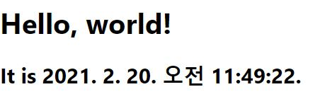

# state와 생명주기

이번 장에서는 우리가 전에 만들었던 tick 함수를 다시 살펴보도록 하겠다.

```
function tick() {
  const element = (
    <div>
      <h1>Hello, world!</h1>
      <h2>It is {new Date().toLocaleString()}.</h2>
    </div>
  );

  ReactDOM.render(element, document.getElementById('root'));
}

setInterval(tick, 1000);
```

<br>
이전에 우리가 배운 엘리먼트 렌더링은 매번 함수를 다시 호출해 React DOM이 DOM에 업데이트 하는 방식이었다.

이번 장에서 우리는 위의 tick 함수를 Clock 컴포넌트로 만들어 완전히 재사용하고 캡슐화하는 방법을 배울 것이다.

Clock 컴포넌트는 스스로 타이머를 설정하고 매초 스스로 업데이트 할 것이다.

일단 화면에 출력하는 부분을 Clock 컴포넌트로 작성해보자.

```
function Clock(props) {
  return (
    <div>
      <h1>Hello, world!</h1>
      <h2>It is {props.date.toLocaleString()}.</h2>
    </div>
  );
}

function tick() {
  ReactDOM.render(
    <Clock date = {new Date()} />,
    document.getElementById('root')
  );
}

setInterval(tick, 1000);
```

<br>
정상적으로 동작한다!! 이걸로 끝인가?

아니다. 우리의 목적은 Clock 컴포넌트가 스스로 타이머를 설정하고 매 초마다 업데이트를 해야한다.

우리의 최종 목표 코드는 아래와 같다.

```
ReactDOM.render(<Clock />, document.getElementById('root'));
```

<br>
이것을 구현하기 위해서 Clock 컴포넌트에 "state"를 추가해야 한다.

State는 얼핏 보면 props와 유사하지만, 비공개이고 컴포넌트에 의해 완전히 제어된다. 오늘 이 장을 보고 state에 대해 어느정도 이해하고 넘어갈 수 있으면 좋겠다.

State는 지금까지 배운 바로는 함수형 컴포넌트에서는 사용할 수 없다. 후에 hook을 배우면 사용할 수 있지만 우린 아직 이에 대해 배운바가 없으니 state를 사용하기 위해 클래스 컴포넌트를 사용하도록 하겠다.

<hr>

## 함수에서 클래스로 변환하기

아래의 다섯 단계를 거쳐 Clock 함수 컴포넌트를 클래스 컴포넌트로 변환할 수 있다.

1. React.Component를 확장하는 동일한 이름의 ES6 class를 생성한다.
2. render()라고 불리는 메서드를 추가한다.
3. 함수의 내용을 render() 내부로 옮긴다.
4. render() 내용 안에 있는 props를 this.props로 변경한다.
5. 이전의 함수 컴포넌트를 삭제한다.

위의 다섯 단계를 진행하면 아래와 같은 클래스 컴포넌트를 만들 수 있다.

```
class Clock extends React.Component{
  render() {
    return (
      <div>
        <h1>Hello, world!</h1>
        <h2>It is {this.props.date.toLocaleString()}.</h2>
      </div>
    );
  }
}
```

<br>

완전히 변환되어 정상 동작하는 것을 아래와 같이 확인할 수 있다.



<hr>

## 클래스에 로컬 State 추가하기

이번에는 세 단계를 거쳐서 date를 props에서 state로 이동시켜보자.

1. render() 메서드 안에 있는 this.props.date를 this.state.date로 변경한다.

```
class Clock extends React.Component{
  render() {
    return (
      <div>
        <h1>Hello, world!</h1>
        <h2>It is {this.state.date.toLocaleString()}.</h2>
      </div>
    );
  }
}
```

<br>

2. 초기 this.state를 지정하는 class constructor를 추가한다.

```
class Clock extends React.Component{
  constructor(props) {
    super(props);
    this.state = {date: new Date()};
  }

  render() {
    return (
      <div>
        <h1>Hello, world!</h1>
        <h2>It is {this.state.date.toLocaleString()}.</h2>
      </div>
    );
  }
}
```

<br>

여기서 눈여겨볼 부분은 super(props)다. 이 부분은 props로 기본 constructor를 호출하는 부분이다.

클래스 컴포넌트는 항상 props로 기본 consturtor를 호출해야한다.

<br>

3. <Clock /> 요소에서 date prop을 삭제한다.

```
ReactDOM.render(<Clock />, document.getElementById('root'));
```

<br>
setIterval 처럼 타이머 역할을 하는 코드는 나중에 추가하도록 하고, 일단 현재까지 완료된 코드는 아래와 같다.

```
class Clock extends React.Component{
  constructor(props) {
    super(props);
    this.state = {date: new Date()};
  }

  render() {
    return (
      <div>
        <h1>Hello, world!</h1>
        <h2>It is {this.state.date.toLocaleString()}.</h2>
      </div>
    );
  }
}

ReactDOM.render(<Clock />, document.getElementById('root'));
```

<br>
화면에는 움직이지는 않지만 시간이 출력되는 것을 볼 수 있다.

다음으로 Clock이 스스로 타이머를 설정해 매초 스스로 업데이트하도록 만들어보자.

<hr>

## 생명주기 메서드를 클래스에 추가하기

많은 컴포넌트가 있는 애플리케이션에서 컴포넌트가 삭제될 때 해당 컴포넌트가 사용중이던 리소스를 확보하는 것이 중요하다.

Clock은 DOM에 렌더링 될 때마다 타이머를 설정하는데 이것을 "마운팅"이라고 부른다. 즉, 컴포넌트가 새롭게 생성되는 것이 "마운팅"이다.

Clock에 의해 생성된 DOM이 삭제될 때마다 타이머를 해제하려고 할 것이다. 이것을 "언마운팅"이라고 부른다.

컴포넌트가 생성되는 것은 "마운팅", 컴포넌트가 제거되는 것은 "언마운팅"이라고 이해하면 된다.

컴포넌트 클래스에서 특별한 메서드를 선언해 컴포넌트가 마운트되거나 언마운트 될 때 일부 코드를 넣어 동작하게 할 수 있다.

```
class Clock extends React.Component{
  constructor(props) {
    super(props);
    this.state = {date: new Date()};
  }

  componentDidMount() {

  }

  componentWillUnmount() {

  }

  render() {
    return (
      <div>
        <h1>Hello, world!</h1>
        <h2>It is {this.state.date.toLocaleString()}.</h2>
      </div>
    );
  }
}
```

<br>

컴포넌트가 마운트 된 직후 componentDidMount 메서드가 실행되고, 언마운트 되기 직전에 componentWillUnmount가 실행된다.

따라서 componentDidMount에는 타이머를 설정하고, componentWillUnmount에는 타이머를 해제하는 작업을 진행하면 우리가 원하는 째깍거리는 시계를 만들 수 있다.

이러한 메서드들을 "생명주기 메서드"라고 부른다.

일단 componentDidMount에 타이머를 설정해보자.

```
componentDidMount() {
    this.timerID = setInterval(
      () => this.tick(),
      1000
    );
  }
```

<br>

이제는 componentWillUnmount에서 타이머를 해제해보자.

```
componentWillUnmount() {
    clearInterval(this.timerID);
}
```

<br>

마지막으로 Clock 컴포넌트가 매초 작동하도록 하는 tick() 메서드를 만들어보자.

```
tick() {
    this.setState({
      date: new Date()
    });
  }
```

<br>

tick 메서드에서 state에 접근하기 위해 setState를 사용한 것을 기억해줬으면 좋겠다.

최종 코드는 아래와 같다.

```
class Clock extends React.Component{
  constructor(props) {
    super(props);
    this.state = {date: new Date()};
  }

  componentDidMount() {
    this.timerID = setInterval(
      () => this.tick(),
      1000
    );

  }

  componentWillUnmount() {
    clearInterval(this.timerID);
  }

  tick() {
    this.setState({
      date: new Date()
    });
  }

  render() {
    return (
      <div>
        <h1>Hello, world!</h1>
        <h2>It is {this.state.date.toLocaleString()}.</h2>
      </div>
    );
  }
}

ReactDOM.render(<Clock />, document.getElementById('root'));
```

<br>

우리가 만든 Clock는 매초 째깍거리며 움직인다.

우리가 만든 코드의 동작을 요약해보자.

1. ReactDOM.render()를 통해 Clock 컴포넌트가 전달되면 React가 Clock의 constructor를 호출한다. - constructor 내부의 this.state를 통해 state를 초기화 한다.
2. React는 Clock의 render() 메서드를 호출한다. - render를 통해 React DOM의 내용과 DOM을 비교해 DOM을 업데이트 한다.
3. DOM에 처음 업데이트되면 componentDidMount()를 실행한다. - componentDidMount에 작성한 타이머가 동작한다.
4. 매초 타이머에 정의한 tick() 메서드가 호출해 UI를 업데이트한다.
5. 만약 Clock 컴포넌트가 DOM에서 삭제될 때가 있으면 componentWillUnmount가 실행돼 타이머가 해제된다.

실제로 우리의 코드에서 componentDidMount는 처음에 딱 한번 실행된다. 그리고 우리는 타이머를 없애지 않으므로 componentWillUnmount는 실행되지 않는다.

<hr>

## State를 올바르게 사용하기

### 직접 State를 수정하지 말라.

아래의 코드는 컴포넌트를 다시 렌더링하지 않는다.

```
this.state.comment = 'Hello';
```

<br>

우리는 아래와 같이 setState()를 사용해 state를 업데이트 해야한다.

```
this.setState({comment: 'Hello'});
```

<br>
this.state를 지정할 수 있는 유일한 공간은 constructor 뿐이다.

### State 업데이트는 비동기적일 수도 있다.

React는 성능을 위해 여러 setState() 호출을 단일 업데이트로 한꺼번에 처리할 수 있다.

this.props와 this.state가 비동기적으로 업데이트될 수 있기 때문에 state를 변경할 때 현재 state에 의존해서는 안된다.

예를 들면 아래의 코드는 카운터 업데이트에 실패할 수 있다.

```
this.setState({
    counter: this.state.counter + this.props.increment
});
```

<br>
카운터를 제대로 업데이트 하기 위해 객체보다 아래와 같이 함수를 인자로 사용하는 setState()를 사용해야 한다.

```
this.setState((state, props) => {
    return {
        counter: state.counter + props.increment
    };
});
```

### State 업데이트는 병합됩니다.

이 부분은 JS에서 Object를 다뤘으면 이해하기 쉬운데, setState()를 사용할 때 state의 해당 키부분만을 사용할 수 있다는 당연한 이야기다.

```
constructor(props) {
    super(props);
    this.state = {
        posts: [],
        comments: []
    };
}

componentDidMount() {
    fetchPosts().then(response => {
        this.setState({
            posts: response.posts
        });
    });
}
```

componentDidMount에서 setState를 통해 state의 posts의 값을 설정했는데 이는 commnets의 값에는 전혀 영향을 끼치지 않는다.

<hr>

## 데이터는 아래로 흐른다

state는 다른 언어의 클래스에서 private와 같다. state는 해당 컴포넌트만 소유할 수 있기 때문이다.

state의 값은 자식 컴포넌트에 props로는 전달할 수 있다.

```
<FormattedDate date = {this.state.date} />
```

<br>
FormattedDate 컴포넌트는 date를 자신의 props로 받을 것이고, 이것이 Clock의 state로 부터 받은 값인지, Clock의 props로 받은 값인지, 아니면 사용자가 직접 입력한 값인지는 알 수 없다.

<br>
리액트의 가장 독특한 부분이 나는 이부분이라고 생각한다. 상위 컴포넌트에서 하위 컴포넌트로 데이터의 흐름이 단방향으로 흐른다. 따라서 데이터 흐름을 찾기 쉬운 장점이 있다. 

하지만 하위 컴포넌트의 변경사항이 상위 컴포넌트로 전달되어야 할 때에는 추가적인 장치가 필요하다.

props는 폭포수와 같다고 생각하면 이해하기 쉬울 것이다. 항상 위에서 아래로 흐른다. 그리고 state는 해당 폭포로 흘러 들어가는 물줄기다. state는 props가 되어 아래로 떨어질 수 있다.