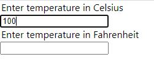
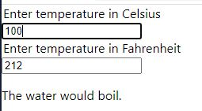

# State 끌어올리기

> 종종 동일한 데이터에 대한 변경 사항을 여러 컴포넌트에 반영해야  할 필요가 있습니다. 이럴 때는 가장 가까운 공통 조상으로 state를 끌어올리는 것이 좋습니다. 이런 일을 어떻게 할 수 있을지 지금부터 살펴봅시다.


이번 섹션에서는 주어진 온도에서 물의 끓는 여부를 판단하는 온도 계산기를 만들 것이다.


먼저 BoilingVerdict라는 이름의 컴포넌트부터 만들어보자. 이 컴포넌트는 섭씨 온도를 의미하는 celsius prop을 받아서 이 온도가 물이 끓는지 아닌지를 출력한다.

```javascript
function BoilingVerdict(props) {
  if (props.celsius >= 100) {
    return <p>The water would boil.</p>;
  }
  return <p>The water would not boil.</p>;
}
```


위의  BoilingVerdict 컴포넌트는 이제 이해할 수 있을 것이다. props의 celsius 값이 100 이상일 때와 이하일 때 다른 엘리먼트를 리턴하는 컴포넌트다.


다음으로 Calculator 컴포넌트를 만들어보자. 이 컴포넌트는 온도를 입력할 수 있는 \<input>을 렌더링하고, 그 값을 state에 저장한다. 또한 현재 입력값에 대한 BoilingVerdict 컴포넌트를 렌더링한다.


코드를 살펴보자.

```javascript
function BoilingVerdict(props) {
  if (props.celsius >= 100) {
    return <p>The water would boil.</p>;
  }
  return <p>The water would not boil.</p>;
}

class Calculator extends React.Component {
  constructor(props) {
    super(props);

    this.state = {temperature: ''};

    this.handleChange = this.handleChange.bind(this);
  }

  handleChange(event) {
    this.setState({temperature: event.target.value});
  }

  render() {
    const temperature = this.state.temperature;
    return (
    <div>
      <legend>Enter temperature in Celsius:</legend>
      <input type="text" value={temperature} onChange={this.handleChange} />
      <hr />
      <BoilingVerdict celsius={parseFloat(temperature)} />
    </div>
    );
  }
}

ReactDOM.render(<Calculator />, document.getElementById('root'));
```

<br>

이전 폼 섹션에서 배운 부분이 대부분이다. input 태그의 value를 handleChange로 제어하고, handleChange의 setState로 인해 변한 값으로 물이 끓는지 여부를 판단해 화면에 출력한다.

<hr>

## 두 번째 Input 추가하기

이번엔 화씨를 입력받는 필드를 추가해보자. 최종 목표는 섭씨 온도를 입력하면 화씨 온도가 동기화되고, 화씨 온도를 입력하면 섭씨 온도가 동기화 된 후 물이 끓는지 여부를 판단하는 것이다.

일단 Calculator 컴포넌트에서 Temperature 컴포넌트를 빼내는 작업부터 해보자.

```javascript
const scaleNames = {
  c: 'Celsius',
  f: 'Fahrenheit'
};

class TemperatureInput extends React.Component {
  constructor(props) {
    super(props);
    this.state = {temperature: ''};
    this.handleChange = this.handleChange.bind(this);
  }

  handleChange(event) {
    this.setState({temperature: event.target.value});
  }

  render() {
    const temperature = this.state.temperature;
    const scale = this.props.scale;

    return (
      <div>
        <legend>Enter temperature in {scaleNames[scale]}</legend>
        <input type="text" value={temperature} onChange={this.handleChange} />
      </div>
    );
  }
}
```

<br>

일단 scaleNames를 만들어서 섭씨일 때와 화씨일 때를 나눴다. 23번 줄을 보면 props.scale 값에 따라 scaleNames를 출력하는 것을 볼 수 있을 것이다.

이제 화면에 이를 출력해보자.

```javascript
class Calculator extends React.Component {
  constructor(props) {
    super(props);
  }

  render() {
    return (
    <div>
      <TemperatureInput scale="c" />
      <TemperatureInput scale="f" />
    </div>
    );
  }
}

ReactDOM.render(<Calculator />, document.getElementById('root'));
```

<br>

자, 두 개의 input을 받는 화면을 만날 수 있을 것이다.



<hr>

## 변환 함수 작성하기

먼저, 섬씨를 화씨로, 또는 그 반대로 변환해주는 함수를 작성해보자.

```javascript
function toCelsius(fahrenheit) {
  return (fahrenheit - 32) * 5 / 9;
}

function toFahrenheit(celsius) {
  return (celsius * 9 / 5) + 32;
}
```

<br>

이번에는 위에서 만든 함수를 콜백 함수로 사용해 온도를 입력받고 변환 결과를 문자열로 반환하는 함수를 만들어보자.

```javascript
function tryConvert(temperature, convert) {
  const input = parseFloat(temperature);
  
  if (Number.isNaN(input)) {
    return '';
  }

  const output = convert(input);
  const rounded = Math.round(output * 1000) / 1000;

  return rounded.toString();
}
```

<br>

매개변수의 temperature은 사용자가 input 태그에 입력한 값이 들어갈 것이고, convert에는 toCelsius 또는 toFahrenheit 함수가 들어갈 것이다.


<hr>

## State 끌어올리기

현재는 두 TemperatureInput 컴포넌트가 입력값을 각각 자신의 state에 독립적으로 저장하고 있다.

우리는 두 값을 동기화 하기를 원하기 때문에 개별적으로 가지고 있는 state를 공통의 조상으로 끌어올려서 동기화를 하도록하겠다. 즉, 각각 가지고 있는 state.temperature를 Calculator로 옮길 것이다.

**TemperatureInput은 props를 input 태그의 value로 가질 것이다. input 태그 onChange 이벤트를 제어하는 handleChange 이벤트 핸들러 역시도 props로 받아 이벤트를 다룰 것이다.**

그렇기 때문에 이벤트를 제어하는 부분을 TemperatureInput 컴포넌트의 부모인 Calculator에 정의하고, 이를 props로 TemperatureInput 컴포넌트에 넘길 것이다.

아래 코드를 보며 차근차근 알아가보자.

```javascript
class TemperatureInput extends React.Component {
  constructor(props) {
    super(props);
    this.handleChange = this.handleChange.bind(this);
  }

  handleChange(event) {
    this.props.onTemperatureChange(event.target.value);
  }

  render() {
    const temperature = this.props.temperature;
    const scale = this.props.scale;

    return (
      <div>
        <legend>Enter temperature in {scaleNames[scale]}</legend>
        <input type="text" value={temperature} onChange={this.handleChange} />
      </div>
    );
  }
}
```

<br>

우리의 TemperatureInput 컴포넌트는 이렇게 바뀔 것이다.

state가 사라졌고, 이전에 temperature와 handleChange에 사용되던 부분은 props로 대체되었다.

그럼 Calculator 컴포넌트를 살펴보도록 하자.

```javascript
class Calculator extends React.Component {
  constructor(props) {
    super(props);
    this.state = {
      temperature: '',
      scale: 'c'
    }
    this.handleCelsiusChange = this.handleCelsiusChange.bind(this);
    this.handleFahrenheitChange = this.handleFahrenheitChange(this);
  }

  handleCelsiusChange(temperature) {
    this.setState({scale: 'c', temperature});
  }

  handleFahrenheitChange(temperature) {
    this.setState({scale: 'f', temperature});
  }

  render() {
    const scale = this.state.scale;
    const temperature = this.state.temperature;
    const celsius = scale === 'c' ? temperature : tryConvert(temperature, toCelsius);
    const fahrenheit = scale === 'f' ? temperature : tryConvert(temperature, toFahrenheit);

    return (
    <div>
      <TemperatureInput scale="c" temperature={celsius} onTemperatureChange={this.handleCelsiusChange} />
      <TemperatureInput scale="f" temperature={fahrenheit} onTemperatureChange={this.handleFahrenheitChange} />
      <BoilingVerdict celsius={celsius} />
    </div>
    );
  }
}
```

<br>

어렵게 느껴질 수도 있다. 하지만 하나씩 차근차근 보면 그렇게 어렵진 않을 것이다.

일단 constructor부터 보자. this.state를 통해 state의 초기값을 설정해준다. scale을 c로 설정했는데 이는 f로 바꿔도 무방하다.

다음으로는 handleCelsiusChange와 handleFahrenheitChange 부분이다. 여기서 중요한 것은 매개변수로 temperature를 받는다는 점이다. 이 두 메서드는 TemperatureInput의 onTemperatureHandle prop으로 사용되는 부분인데 TemperatureInput의 input 태그의 value가 변하는 것을 handleChange 이벤트 핸들러로 캐치한 후 해당 value를 사용해 Calculator 컴포넌트의 state를 변경시킨다. 아래 화살표를 보면 좀 더 이해가 쉬울 거라 믿는다.

> input 태그에 온도 입력 -> TemperatureInput 컴포넌트의 handleChange가 onTemperatureChange (이는 handleCelsiusChange가 될 수도 있고 handleFahrenheith가 될 수도 있음) 호출 -> Calculator 컴포넌트의 handleCelsiusChange 또는 handleFahrenheithChange가 자신의 state를 업데이트

위의 방법으로 진행된다.

결과는 아래 사진과 같다.



<hr>

## 교훈

한 컴포넌트에서의 변경이 다른 컴포넌트에 영향을 준다면, 이 부분을 공동 부모의 state로 관리하고, 해당 자식은 prop으로 받는 것이 React의 하향식 데이터 흐름을 유지할 수 있는 좋은 방법이다.

state를 끌어올린다는 말은 자식의 state를 부모의 state로 올린다는 말이다. 이 작업은 양방향 바인딩 (Angular에서 사용) 접근 방식보다 더 많은 노력이 들어간다(Angular 같은 경우 scope을 사용해 가져오기만 하면 되므로 서로의 상태 변화를 이용할 수 있다). 하지만 이렇게 단방향으로 데이터 흐름을 유지할 수 있다면 버그를 찾고, 격리하기 더 쉽게 만든다는 장점이 있다. 데이터의 흐름을 살펴보기도 훨씬 수월하다. 