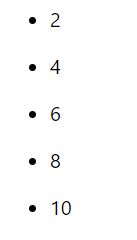
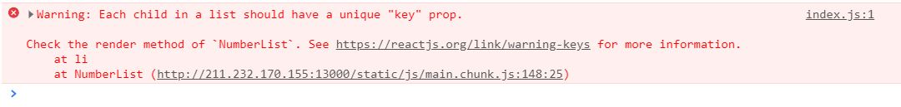

# 리스트와 Key

아래 코드는 JS에서 map() 함수를 사용해 numbers 배열의 값을 두배로 만들어 doubled 변수에 할당하는 코드이다.

```
const numbers = [1, 2, 3, 4, 5];
const doubled = numbers.map(number => number * 2);
```

<br>

React에서 배열을 엘리먼트 리스트로 만드는 방식은 이와 거의 동일하다.

### 여러개의 컴포넌트 렌더링 하기

이전에 사용한 numbers 배열을 사용해 모든 값은 2배로 변환하여 리스트를 만들어보자.

```
const numbers = [1, 2, 3, 4, 5];
const listItems = numbers.map(number => {
  return (
      <li>{number * 2}</li>
  );
});

ReactDOM.render(<ul>{listItems}</ul>, document.getElementById('root'));
```

<br>

중괄호(\{})를 사용해서 number \* 2의 값을 받아 리스트를 만드는 listItems 엘리먼트를 화면에 출력하면 아래 사진과 같다.

<br>



<br>

### 기본 리스트 컴포넌트

일반적으로 컴포넌트 안에서 리스트를 렌더링한다.

숫자 리스트를 렌더링하는 NumberList 컴포넌트를 만들어보자.

```
const numbers = [1, 2, 3, 4, 5];

function NumberList(props) {
  const numbers = props.numbers;
  const listItems = numbers.map(number => <li>{number * 2}</li>);

  return <ul>{listItems}</ul>
}

ReactDOM.render(
  <NumberList numbers = {numbers} />,
  document.getElementById('root')
  );
```

<br>

이 코드를 이용하면 아래와 같은 에러가 뜰 것이다.

<br>



<br>

리스트의 각 항목에 key를 넣어야 한다는 경고 메시지다.

"Key"는 엘리먼트 리스트를 만들 때 포함해야 하는 특수한 문자열 어트리뷰트이다.

numbers.map() 안에서 리스트의 각 항목에 key를 부여해 키 누락문제를 해결해보자.

```
const numbers = [1, 2, 3, 4, 5];

function NumberList(props) {
  const numbers = props.numbers;
  const listItems = numbers.map(number =>
    <li key = {number.toString()}>
      {number * 2}
    </li>
  );

  return <ul>{listItems}</ul>
}

ReactDOM.render(
  <NumberList numbers = {numbers} />,
  document.getElementById('root')
);
```

<br>

li 태그 안에 key 어트리뷰트를 number의 값을 줬더니 문제가 해결되었다.

<hr>

## Key

Key는 React가 배열의 어떤 항목을 식별하는데 도움을 준다. key는 엘리먼트에 안정적인 고유성(Identity)을 부여하기 위해 배열 내부의 엘리먼트에 지정해야 한다.

```
function NumberList(props) {
  const numbers = props.numbers;
  const listItems = numbers.map(number =>
    <li key = {number.toString()}>
      {number * 2}
    </li>
  );

  return <ul>{listItems}</ul>
}
```

<br>

li 태그에 key를 준 이유도 이와 같다. map() 함수는 배열을 반환하기 때문에 보이는 것과 달리 실제로 listItems는 \<li> 태그들의 배열이다.

Key를 선택하는 가장 좋은 방법은 리스트의 다른 항목들 사이에서 해당 항목을 고유하게 식별할 수 있는 문자열을 사용하는 것이다. 대부분 데이터의 ID를 key로 사용하고, 만약 고유한 ID가 없다면 최후의 수단으로 항목의 index를 key로 사용할 수 있다.

```
const todoItems = todo.map((todo, index) => {
    <li key={index}>
        {todo.text}
    </li>
});
```

<br>

항목의 순서가 바뀔 수 있는 경우 key에 인덱스 사용을 하지 않는 것이 좋다. 이로 인해 성능이 저하되거나 컴포넌트의 state와 관련된 문제가 발생할 수 있다.

만약 리스트 항목에 명시적으로 key를 지정하지 않으면 React는 기본적으로 인덱스를 key로 사용한다.

### Key는 형제 사이에서만 고유한 값이어야 한다.

키는 주변 배열의 context에서만 의미가 있다.

우리가 만든 listItems를 다시 생각해보자. 만약 listItems를 여러번 사용하게 됐을 때 첫번째 사용했던 배열들의 key값과 두번째 사용된 배열들의 key값이 완전히 다를 필요는 없다. 첫번째 listitems의 1번 요소의 키값과 두번째 listItems의 1번 요소의 키값은 같아도 된다.

즉, 한 배열 내에서만 구분될 수 있는 키를 사용하면 되고, 다른 배열과는 서로 영향을 주지 않는다는 말이다.
