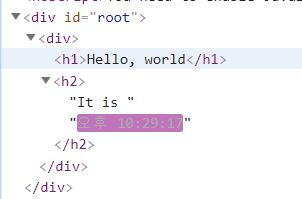

# 엘리먼트 렌더링

**엘리먼트는 React 앱의 가장 작은 단위**

엘리먼트는 화면에 표시할 내용을 가진다.

```
cosnt element = <h1>Hello, world</h1>;
```

브라우저 DOM 엘리먼트와 달리 React 엘리먼트는 일반 객체이고, 쉽게 생성할 수 있다.
React DOM은 우리가 생성한 React 엘리먼트와 일치하도록 DOM을 업데이트 한다.

우리는 React DOM에 엘리먼트를 만들고, React DOM은 우리가 만든 엘리먼트를 자동적으로 브라우저 DOM에 업데이트 한다.

엘리먼트는 우리가 다음 장에서 배울 컴포넌트와는 다른 개념이다. 엘리먼트는 컴포넌트 내에 속하는 컴포넌트의 "구성 요소"다.

## DOM에 엘리먼트 렌더링 하기

React로 만든 애플리케이션은 일반적으로 하나의 루트 DOM 노드가 있다.

우리가 React로 나타낸 모든 것은 루트 DOM에 표현될 것이다. (루트 DOM에 표현 안할 수도 있는데 그럼 왜 만들지?)

내가 만든 react app에서는 루트 div가 있어서 index.js에서 만든 엘리먼트를 루트 div에 넣어서 화면에 보여준다. 루트 div는 index.html에 들어가면 확인할 수 있는데 다음과 같은 모양으로 있다.

```
<div id="root"></div>
```

<br>

React 엘리먼트를 루트 DOM 노드에 렌더링 하려면 ReactDom.render()를 사용하면 된다.

```
const element = <h1>Hello, world</h1>;

ReactDOM.render(element, document.getElementById('root'));
```

~~나는 위의 코드를 보면서 지금까지 혼자 품고 있던 의문이 풀렸다. ReactDom.render 안에 ','를 딱 하나 사용하는데 이게 뭘 의미하는건지 혼자 고민했는데 위의 형태로 보니 매개변수를 나누는 용이었다... 개행해서 봐서 ReactDom.render가 매개변수를 갖는다고 생각을 못했었는데 정말 바보같았다 ㅋㅋ~~

본문으로 돌아와서 위의 코드를 지겹도록 많이 실행했는데, 결과는 알 것이다. 화면에 Hello, world가 보일 것이다.

<hr>

## 렌더링 된 엘리먼트 업데이트하기

React의 엘리먼트는 불변객체이다. 엘리먼트를 생성하면 엘리먼트의 자식이나 속성을 변경할 수 없다. JS를 이미 배우고 왔기 때문에 const로 element를 선언했기 때문에 바꿀 수 없다는 것을 충분히 이해할 것이다. const로 선언한 element의 값을 바꿔봐라. 에러가 반겨줄 것이다.

그래서 우리가 한번 화면에 뿌린 내용을 업데이트 하기 위해서는 엘리먼트를 새로 생성해서 다시 루트 DOM으로 전달하는 방법 뿐이다.

```
function tick() {
  const element = (
    <div>
      <h1>Hello, world</h1>
      <h2>It is {new Date().toLocaleTimeString()}</h2>
    </div>
  );

  ReactDOM.render(element, document.getElementById('root'));
}

setInterval(tick, 1000);
```

tick 함수는 현재 시간을 나타내는 element를 만들고 ReactDom.render를 사용해 루트 DOM으로 element를 전달한다.
setInterval을 사용해 tick 함수를 1초 간격으로 실행해 1초마다 루트 DOM에 element를 전달해줄 것이다.

<hr>

## 변경된 부분만 업데이트하기

방금 만든 tick 함수에서 element 부분만 자세히 다시 보겠다.

```
const element = (
    <div>
      <h1>Hello, world</h1>
      <h2>It is {new Date().toLocaleTimeString()}</h2>
    </div>
  );
```

element는 현재 시간을 나타내는 부분 뿐 아니라 "Hello, world"를 나타내는 부분도 있다. 그리고 tick 함수는 이 전체를 React DOM에 렌더링한다. 그럼 시간을 제외한 부분은 바뀌지 않는데 계속 호출하는 것은 비효율적이지 않나?(라는 의문이 들면 나보다 뛰어나신 분이니 저좀 가르쳐주세요..)

React DOM은 똑똑하게도 바뀐 부분만 브라우저 DOM에 전달한다. 우리가 만든 코드를 실행하고 개발자도구를 켜고 소스를 보면 이를 확인할 수 있다.



위의 사진을 보면 Hello, world 부분과 It is는 변하지 않고, 시간 부분만 변한 것을 볼 수 있다.

이렇게 똑똑한 React를 안쓸 이유가 있을까?(있다면 저좀 알려주세요 ㅠㅠ)
