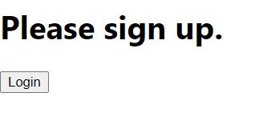
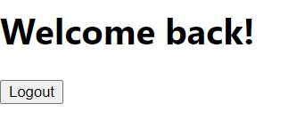
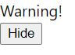
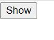

# 조건부 렌더링

> React에서는 원하는 동작을 캡슐화하는 컴포넌트를 만들 수 있습니다. 이렇게 하면 애플리케이션의 상태에 따라서 컴포넌트 중 몇 개만을 렌더링 할 수 있습니다.

React에서 조건부 렌더링은 JS에서의 조건 처리와 같다. if나 switch 같은 조건 연산자를 사용해 조건에 맞는 컴포넌트를 렌더링 하면 된다.

아래 두 컴포넌트가 있다고 가정해보자.

```
function UserGreeting(props) {
    return <h1>Welcome back!</h1>;
}

function GuestGreeting(props) {
    return <h1>Please sign up.</h1>
}
```

<br>

이제 사용자의 로그인 상태에 맞게 위의 두 컴포넌트 중 하나를 보여주는 Greeting 컴포넌트를 만들자.

```
function Greeting(props) {
  const isLoggedIn = props.isLoggedIn;
  if (isLoggedIn) {
    return <UserGreeting />;
  }
  return <GuestGreeting />;
}

ReactDOM.render(
    <Greeting isLoggedIn={false} />,
    document.getElementById('root')
);
```

<br>

위의 코드를 실행하면 아래처럼 isLoggedIn prop에 따라 다른 인사말을 렌더링하는 페이지를 볼 수 있을 것이다.

<br>


<br>


<br>

### 엘리먼트 변수

엘리먼트를 저장하기 위해 변수를 사용할 수 있다. 출력의 다른 부분은 변경하지 않고, 컴포넌트의 일부를 조건부로 렌더링 할 수 있다. 프로그래밍을 어느 정도 해본 사람들은 이 말이 무슨말인지 쉽게 이해할 수 있겠지만 아닌 사람들은 조금 어렵게 들릴 것이다.

우리가 위에서 본 예제는 컴포넌트 자체를 조건부로 렌더링 하는 것이었다. isLoggedIn이 true이면 UserGreeting 컴포넌트가 렌더링되고, isLoggedIn이 false이면 GuestGreeting 컴포넌트가 렌더링 된다.

이번에 살펴볼 예제는 컴포넌트는 동일한게 렌더링 되지만 내부의 일부분만 변경해서 렌더링하는 것이다.

로그아웃과 로그인 버튼을 나타내는 두 컴포넌트가 있다고 가정해보자.

```
function LoginButton(props) {
  return (
    <button onClick={props.onClick}>
      Login
    </button>
  );
}

function LogoutButton(props) {
  return (
    <button onClick={props.onClick}>
      Logout
    </button>
  );
}
```

<br>

로그인 버튼과 로그아웃 버튼 모두 prop의 onClick 동작을 할 것이다.

아래 코드에서는 LoginControl이라는 유상태 컴포넌트(State를 가진 클래스형 컴포넌트)를 만들고, 이전에 사용했던 \<Greeting /> 컴포넌트도 함께 렌더링 할 것이다.

이 컴포넌트는 현재 상태에 맞게 \<LoginButton />이나 \<LogoutButton /> 을 렌더링한다.

```
class LoginControl extends React.Component {
  constructor(props) {
    super(props);
    this.handleLoginClick = this.handleLoginClick.bind(this);
    this.handleLogoutClick = this.handleLogoutClick.bind(this);
    this.state = {isLoggedIn: false};
  }

  handleLoginClick() {
    this.setState({isLoggedIn: true});
  }

  handleLogoutClick() {
    this.setState({isLoggedIn: false});
  }

  render() {
    const isLoggedIn = this.state.isLoggedIn;
    let button;
    if (isLoggedIn) {
      button = <LogoutButton onClick = {this.handleLogoutClick} />;
    } else {
      button = <LoginButton onClick = {this.handleLoginClick} />;
    }

    return (
      <div>
        <Greeting isLoggedIn = {isLoggedIn} />
        {button}
      </div>
    );
  }
}

ReactDOM.render(
  <LoginControl />,
  document.getElementById('root')
);
```

<br>

코드가 길게 느껴지지만 자세히 보면 그렇게 어렵진 않다.

if 문이 사용된 곳을 집중적으로 보면 되는데, button 변수에 isLoggedIn 값에 따라 다른 엘리먼트가 들어가고, 마지막 리턴할 때 button 엘리먼트가 렌더링된다.

컴포넌트 전체 수정이 아닌 일부 엘리먼트만 수정하기 위해서는 이렇게 할 수 있다는 것을 알아두면 좋다.

결과를 보여주자면 아래와 같다.

<br>



<br>



<br>

나는 이번 코드를 보면서 this의 사용법을 더 공부해야겠다는 생각이 많이 들었다. 클래스형 컴포넌트를 쓰기 위해서는 어디에 this를 사용해 선언하고, 이를 다시 사용할 때는 this를 붙여야하는지, 붙이지 않아도 되는지 확실하게 구분할 수 없기 때문에 이부분에 대해 좀더 명확하게 공부할 필요성을 느꼈다.

### 컴포넌트가 렌더링하는 것을 막기

가끔 다른 컴포넌트에 의해 렌더링될 때 컴포넌트 자체를 숨기고 싶을 때가 있다. AngularJS를 쓸 때 ng-if와 같은 역할을 말하는데, React에서는 렌더링 결과를 출력하는 대신 null을 반환하면 해결할 수 있다.

아래 예시를 보자.

```
function WarningBanner(props) {
  if (!props.warn) {
    return null;
  }

  return (
    <div className="warning">
      Warning!
    </div>
  );
}

class Page extends React.Component {
  constructor(props) {
    super(props);
    this.state = {showWarning: true};
    this.handleToggleClick = this.handleToggleClick.bind(this);
  }

  handleToggleClick() {
    this.setState(state => ({
      showWarning: !state.showWarning
    }));
  }

  render() {
    return (
      <div>
        <WarningBanner warn = {this.state.showWarning} />
        <button onClick = {this.handleToggleClick}>
          {this.state.showWarning ? 'Hide' : 'Show'}
        </button>
      </div>
    );
  }
}

ReactDOM.render(<Page />, document.getElementById('root'));
```

<br>

Page 컴포넌트의 showWarning state가 false이면 WarnningBanner가 렌더링되지 않을 것이고, true이면 렌더링 되는 것을 볼 수 있을 것이다.

<br>



<br>



<br>
