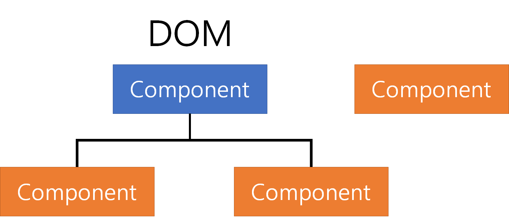

# Portal

<a href="https://github.com/ianstormtaylor/slate">Slate.js</a> 를 사용하면서 에디터의 기능을 수정할 때 `Portal` 을 사용해 메뉴를 생성하는 코드를 보게 되었고, Portal이 뭐지? 하는 궁금증이 생겼다. 

이 궁금증을 해소하기 위해 찾아간 곳은 <a href="https://ko.reactjs.org/docs/portals.html">리액트 포탈</a> 공식 문서였습니다. 리액트에서는 포탈을 아래와 같이 설명한다.

> Portal은 부모 컴포넌트의 DOM 계층 구조 바깥에 있는 DOM 노드로 자식을 렌더링하는 최고의 방법을 제공합니다.


처음에는 이게 무슨 뜻인지 이해가 잘 되지 않았는데 Slate.js의 코드와 문서의 예제들을 보면서 이해하게 되었다.


## 일반적인 부모-자식 컴포넌트 구조

모든 컴포넌트는 독립적으로 존재할 수도 있고, 부모 또는 자식 컴포넌트를 가지고 있을 수도 있다. 여기서 파란색은 부모, 주황색은 파란색 컴포넌트의 자식 컴포넌트가 된다.


그럼 위의 컴포넌트 구조가 있을 때, DOM 트리는 어떻게 구성이 될까?


당연하게도 위의 구조와 같은 DOM 구조가 생길 것이다. 


근데 우리가 자식 컴포넌트를 DOM 트리에서는 외부로 빼고 싶으면 어떻게 할 수 있을까? 외부에 컴포넌트를 생성하고 상태를 전달하는 방법이 가장 먼저 떠오르는데, 만약 계층이 깊어질 경우, 상태 전달을 위해 많은 노력이 필요하게 되고, 유지보수의 어려움으로 나타날 것이다.

다행히도 리액트에서는 Portal을 사용해 리액트 트리에서는 자식이지만, DOM 트리에서는 자식이 아닌 컴포넌트를 만들 수 있다.


## 포탈을 사용한 부모-자식 컴포넌트 구조

이번엔 포탈을 사용한 컴포넌트 구조를 확인해보자.  일단 리액트 트리에서는 변하지 않는다.


DOM 트리에서는 어떻게 보여질까?



주황색 자식 컴포넌트 하나가 밖으로 빠져나갔다. 자식 컴포넌트가 저렇게 외부에 위치하게 할 수도 있고, 심지어는 부모 컴포넌트의 부모 위치에도 놓을 수 있다.


## Portal 사용법

```react
import ReactDOM from 'react-dom';

ReactDOM.createPortal(렌더링 할 수 있는 모든 React 자식, DOM 엘리먼트)
```

Portal은 react-dom의 createPortal을 사용해 생성할 수 있다.

첫 번째 인자로는 렌더링 할 자식 컴포넌트 또는 문자열 등을 받고, 두 번째 인자로는 컴포넌트를 렌더링할 DOM 엘리먼트를 받는다.


이번에는 그럼 Portal을 사용해 기존 CRA로 생성한 앱에서 root div 외부에 컴포넌트를 렌더링 해보자.

```react
// App.js
import { createPortal } from 'react-dom';

function App() {
    return createPortal(<div>body 아래에 렌더링 할 부분입니다.</div>, document.getElementsByTagName('body')[0]);
}
```


CRA로 생성한 앱의 경우 일반적으로 App 컴포넌트가 root div 내에 렌더링 됩니다. 하지만 위처럼 포탈을 생성할 경우 아래 사진처럼 root div 외부에 렌더링 할 수 있다.


근데 이렇게만 사용할거면 그냥 외부 div 만들어서 거기에다가 렌더링하면 되는거 아닌가? 라는 의문이 들 수도 있다. 만약 위처럼 그냥 보여주기만 하는 것이라면 굳이 포탈을 사용하지 않고, 외부에 컴포넌트를 만들고 렌더링 하면 된다. 하지만 포탈의 주 목적은 리액트 트리에서는 자식인 컴포넌트가 DOM 트리에서 외부에 렌더링 되도록 만드는 것이다.

이를 설명하기 위해서, state를 사용한 예제를 한 번 보자.

```react
// App.js
import { useState } from 'react';
import { createPortal } from 'react-dom';

function ParentComponent() {
    const [count ,setCount] = useState(0);
    
    const handleClick = () => {
        setCount(count + 1);
    }
    
    return (
    	<div>
        	{count}
            <Portal>
            	<ChildComponent onClick={handleClick} />
            </Portal>
        </div>
    );
}

function ChildComponent(props) {
    return <button onClick={props.onClick}>+1</button>;
}

function Portal(props) {
    return createPortal(props.children, document.getElementsByTagName('body')[0]);
}

function App() {
    return <ParentComponent />;
}
```

*  `ParentComponent` 는 이름 그대로 부모 컴포넌트다. count 라는 상태를 가지고, 자식 컴포넌트를 클릭하면 count를 1씩 증가시키도록 했다.
* `ChildComponent` 는 자식 컴포넌트로, 부모로 부터 받은 onClick prop을 사용해, 클릭할 경우 부모의 상태를 변화시킨다.
* `Portal` 은 오로지 포탈의 역할만 한다. props.children을 body 내에 렌더링한다.


결과는 아래 사진과 같다.


button이 root div 외부에 렌더링 된 것을 확인할 수 있다. DOM 트리적으로 보면, ChildComponent는 ParentComponent의 자식이 아니다. 하지만 리액트 트리에서는 여전히 ParentComponent의 자식이므로,  버튼을 클릭하면 ParentComponent의 count가 1씩 증가하는 것을 확인할 수 있다.


## 결론

리액트 트리를 건드리지 않고, DOM 트리의 자식 구조를 변경하고 싶을 경우 Portal을 사용할 수 있다. 
