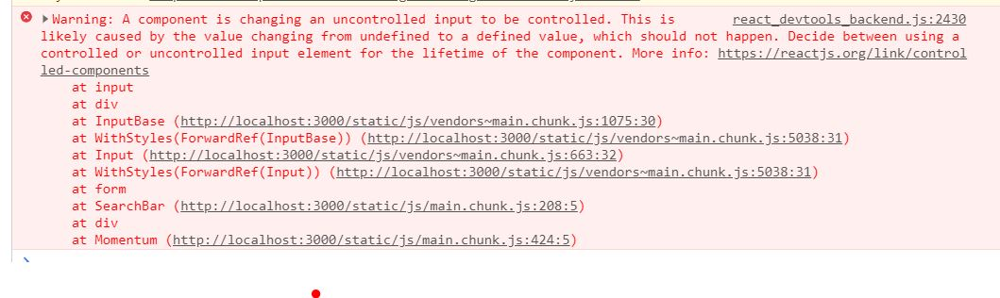

# 컴포넌트의 state가 undefined일 때 발생하는 문제

Momentum을 만들던 도중 input 태그의 onChange 이벤트 핸들러에서 아래와 같은 에러 메시지를 출력했다.



문제가 컴포넌트의 코드는 아래와 같다.

```javascript
class SearchBar extends React.Component {
  constructor(props) {
    super(props);

    this.state = {
      inputValue: this.props.inputValue,
    };

    console.log(this.state.inputValue);
    this.handleSubmit = this.handleSubmit.bind(this);
    this.handleChange = this.handleChange.bind(this);
  }

  handleSubmit(event) {
    event.preventDefault();
    this.props.handleSubmit(this.state.inputValue);
    this.setState({
      inputValue: "",
    });
  }

  handleChange(event) {
    this.setState({
      inputValue: event.target.value,
    });
  }

  render() {
    return (
      <form onSubmit={this.handleSubmit}>
        <Input
          placeholder="Enter TODO"
          type="text"
          value={this.state.inputValue}
          onChange={this.handleChange}
        />
      </form>
    );
  }
}
```

상위 컴포넌트에게 props로 받은 값을 SearchBar 컴포넌트의 state로 사용하고 있으니 이 것부터 권장되지 않는 코드를 작성했다. 그리고 실제로 문제는 여기서 발생한다. Input 컴포넌트의 onChange 이벤트를 담당하는 handleChange 메서드는 `this.state.inputValue`를 가져오는데, `props.inputValue`를 찍어보면 `undefined`다.

그래서 constructor에서 선언한 state의 inputValue는 존재하지 않는 값이 되고, onChange 이벤트 핸들러는 컨트롤하려는 state가 존재하지 않으므로 에러 메시지를 출력한다.

하지만 일단 한번 onChange 핸들러가 실행되어 state.inputValue를 생성하면 에러 메시지가 출력되지 않는다.

요약하면 constructor에서 `this.state=`으로 우리 눈에는 inputValue state를 생성한 것 처럼 보이지만, 실제로는 여기서 생성되지 않았기 때문에 문제가 발생한 것이다.

이 문제의 해결 방법은 두 가지다. 상위 컴포넌트에서 props로 값을 전달할 때, `''`를 전달하지 않고, 실제 존재하는 값을 전달하면 된다. 예를 들면 `<SearchBar inputValue={'값을 입력하세요'} />` 이렇게 SearchBar 컴포넌트를 호출하면 된다. 하지만 이렇게 호출하면 Input 컴포넌트 내에 해당 값이 들어가게 되므로, 나는 다른 방법을 사용했다.

```javascript
constructor(props) {
    super(props);

    this.state = {
      inputValue: ''
    };

    this.handleSubmit = this.handleSubmit.bind(this);
    this.handleChange = this.handleChange.bind(this);
  }
```

생성자만 보여주겠다. 여기서 직접 inputValue의 값을 명시해줬다. 비록 빈 문자열이지만, inputValue를 찍어보면 undefined가 아닌 빈 문자를 보여준다. 명시적으로 inputValue를 선언했으므로, onChange 이벤트 핸들러가 해당 값에 접근할 때 존재하지 않는다는 에러 메시지를 보여주지 않게되고, 상위 컴포넌트의 porps를 생성자에서 state로 선언하지 않아도 된다.
