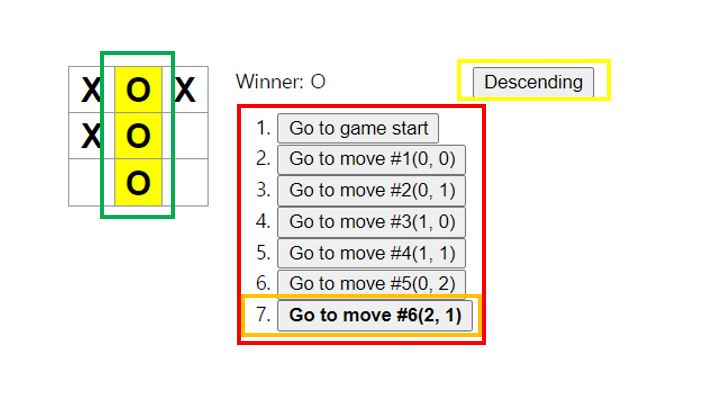

# 튜토리얼

이번에는 리액트 공식 사이트의 튜토리얼의 추가 미션 진행해보도록 하자.

추가 미션의 목록은 아래와 같다.

1. 이동 기록 목록에서 특정 형식(행, 열)으로 각 이동의 위치를 표시.
2. 이동 목록에서 현재 선택된 아이템을 굵게 표시.
3. 사각형을 만들 때 하드코딩 대신에 두 개의 반복문을 사용하도록 Board를 다시 작성.
4. 오름차순이나 내림차순으로 이동을 정렬하도록 토글 버튼 추가.
5. 승자가 정해지면 승부의 원인이 된 세 개의 사각형 강조.
6. 승자가 없는 경우 무승부 메시지 표시.

이 미션을 모두 달성한 화면은 아래 사진과 같을 것이다.



빨간 상자는 1번, 주황색은 2번, 노란색은 4번, 초록색은 5번이다.

## 이동 기록 목록에서 특정 형식(행, 열)으로 각 이동의 위치를 표시

이동 기록 목록을 (행, 열) 형식으로 표현해보자. 이를 하기 위해서 나는 Game 컴포넌트에 클릭한 행, 열 정보를 갖는 state를 추가했다.

```javascript
class Game extends React.Component {
  constructor(props) {
    super(props);

    this.state = {
      history: [{
        squares: Array(9).fill(null),
        position: {
          row: null,
          col: null
        }
      }],
    ...
```

<br>

position은 row와 col의 값을 갖는 객체이고, 초기값은 null(처음엔 아무것도 클릭하지 않은 상태이므로)이다.

이제 클릭할 때 이 position 값을 변경해주어야 하므로, handleClick 메서드를 수정해보자.

```javascript
class Game extends React.Component {
    ...

    handleClick(i) {
    const history = this.state.history;
    const current = history[history.length - 1];
    const squares = current.squares.slice();

    ...

    const row = Math.floor(i / 3);
    const col = i % 3;

    this.setState({
      history: history.concat([{
        squares: squares,
        position: {
          row: row,
          col: col
        }
      }]),

      ...

    });
  }
}
```

<br>

일단 row와 col의 값을 매개변수로 받은 i로부터 구했다. row는 i를 3으로 나눈 값이고, col은 i를 3으로 나눈 나머지다. i / 3을 할 때 주의해야 할 점은 JS에서는 정수형, 실수형 구분 없이 모두 실수로 연산 하는 점이다. 나는 Math.floor를 사용해 버림을 해 정수 값으로 구했다.

이후 setState를 통해 state를 업데이트 했다.

이제 행 열 부분을 추가한 버튼을 만들고, 화면에 렌더링 해보자.

```javascript
const moves = history.map((step, move) => {
      const desc = move ?
        'Go to move #' + move + '(' + step.position.row + ', ' + step.position.col + ')':
        'Go to game start';

      ...
```

<br>

현재 단계 뒤에 step.poision.row와 step.position.col을 사용해 행 열을 표시했다.

## 이동 목록에서 현재 선택된 아이템을 굵게 표시

일단 현재 선택된 목록이 무엇인지를 알아야 하기 때문에 나는 Game 컴포넌트에 stepNumber state를 추가했다.

```javascript
class Game extends React.Component {
  constructor(props) {
    super(props);

    this.state = {
      history: [{
        squares: Array(9).fill(null),
        position: {
          row: null,
          col: null
        }
      }],
      stepNumber: 0,
      ...
```

<br>

stepNumber는 현재 단계의 수다. 0부터 시작하고 최대 9까지 갈 수 있다.

이제 버튼을 클릭할 때마다 stepNumber를 증가시켜주기 위해 다시 한번 handleClick 메서드를 수정해보자.

```javascript
handleClick(i) {
    const history = this.state.history;
    const current = history[history.length - 1];
    const squares = current.squares.slice();

    ...

    this.setState({
      history: history.concat([{
        squares: squares,
        position: {
          row: row,
          col: col
        }
      }]),
      stepNumber: history.length,
      xIsNext: !xIsNext,
    });
}
```

<br>

handleClick에서는 stepNumber의 값을 기존 state의 stepNumber의 값에 1을 더한 값을 주어도 되지만, 나는 시간 여행 버튼을 누를 때, state의 history 배열을 splice를 통해 뒷부분을 아예 없애버렸기 때문에 현재 history의 길이를 stepNumber에 주었다.

이제 현재 상태가 stepNumber와 같으면 해당 버튼을 굵게 표시하기 위해서 render의 moves를 수정하자.

```javascript
const moves = history.map((step, move) => {
      ...

      return (
        <li key={move}>
          <button
            className={move === this.state.stepNumber ? 'font-weight-bold' : ''}
            onClick={() => this.jumpTo(move)}>{desc}
          </button>
        </li>
      );
    });
```

move(history 배열의 index)가 stepNumber와 같을 경우 button의 클래스 이름을 font-weight-bold를 주었다. 이제 css에 font-weight-bold 클래스를 bold 처리하는 것만 추가하면 완성이다.

```css
.font-weight-bold {
  font-weight: bold;
}
```

## 사각형을 만들 때 하드코딩 대신에 두 개의 반복문을 사용하도록 Board를 다시 작성

이 부분은 화면으로 차이를 알 수는 없으나, 이후 보드의 크기를 변경시킬 때 유용하게 사용될 수 있다.

Board 컴포넌트를 아래처럼 바꾸면 된다.

```javascript
class Board extends React.Component {
  renderSquare(i) {
    return (
      <Square
        key={i}
        value={this.props.squares[i]}
        onClick={() => this.props.onClick(i)}
      />
    );
  }

  render() {
    const board = [];
    const TABLE_SIZE = 3;

    for (let row = 0; row < TABLE_SIZE; row++) {
      const boardRow = [];
      for (let col = 0; col < TABLE_SIZE; col++) {
        boardRow.push(this.renderSquare(row * 3 + col));
      }
      board.push(
        <div key={row} className="board-row">
          {boardRow}
        </div>
      );
    }

    return <div>{board}</div>;
  }
}
```

여기서 나도 많이 헤맸는데, render 부분을 주목해서 보자.

일단 board 배열을 선언하고, 우리는 3x3 보드 이므로 TABLE_SIZE 상수를 3으로 설정한다. 여기서 for 반복문을 사용해서 Square를 만들고, 한 행씩 만든 값을 board 배열에 추가할 것이다. 한 행씩 만들어야 하기 때문에 row를 도는 for문의 시작 부분에 boardRow 배열을 선언한다. 그리고 col을 돌면서 renderSquare 메서드를 사용해 Square 컴포넌트를 만들고, 이 값을 boardRow에 하나씩 추가한다. col을 전부 돌면 총 3개의 Square 컴포넌트가 boardRow에 들어가 있을 것이다. 이제 이 boardRow를 board-row 클래스 이름을 가진 div로 감싼 후 board에 추가할 건데 `board.push(<div key={row} className="board-row">{boardRow}</div>);` 여기가 중요하다. div 태그를 선언하고, 안에 중괄호로 boardRow를 넣고 div 태그를 닫아서 한 행을 board 배열에 넣는다.

나는 처음에 아래처럼 코딩했다.

```javascript
class Board extends React.Component {
  renderSquare(i) {
    return <Square key={i} value={this.props.squares[i]} onClick={() => this.props.onClick(i)} />;
  }

  render() {
    const board = [];
    const TABLE_SIZE = 3;

    for (let row = 0; row < TABLE_SIZE; row++) {
      let boardRow = <div className="board-row">;
      for (let col = 0; col < TABLE_SIZE; col++) {
        boardRow += renderSquare((row * 3) + col);
      }
      boardRow += </div>

      board.push(boardRow);
    }
    ...
  }
}
```

<br>

이 코드는 boardRow를 선언할 때 div 태그를 닫지 않아서 에러가 발생한다. 그래서 결국 인터넷 검색의 힘을 빌려 위와 같은 구조로 작성해야 한다는 것을 깨달았다.

## 오름차순이나 내림차순으로 이동을 정렬하도록 토글 버튼 추가

이 부분은 Game 컴포넌트에 isAscending state를 추가하고, 버튼을 새로 생성해 버튼을 클릭할 때마다 isAscending의 값을 true면 false로, false면 true로 변경하고, isAscending에 따라 정렬을 오름차순 또는 내림차순으로 하면 된다.

일단 Game 컴포넌트에 isAscending state를 추가해보자.

```javascript
class Game extends React.Component {
  constructor(props) {
    super(props);

    this.state = {
      history: [{
        squares: Array(9).fill(null),
        position: {
          row: null,
          col: null
        }
      }],
      stepNumber: 0,
      xIsNext: true,
      isAscending: true,
      ...
```

<br>

처음엔 오름차순으로 정렬하기 때문에 isAscending을 true로 초기화 했다. 이제 우리는 새로운 버튼을 추가하고, 버튼을 클릭할 때마다 isAscending의 값을 반전시켜보자.

```javascript
class Game extends React.component {
  ...

  render() {
    const sort = this.state.isAscending ? 'Descending' : 'Ascending';
    ...

    return (
    <div className="game">
      <div className="game-board">
        <Board squares={current.squares} winnerCell={winnerInfo} onClick={this.handleClick} />
      </div>
      <div className="game-info">
        <div>{status}</div>
        <ol>{moves}</ol>
      </div>
      <div>
        <button onClick={this.handleAscending}>{sort}</button>
      </div>
    </div>
  );
}
```

<br>

\<button onClick={this.handleAscending}>{sort}</button> 부분을 주목해서 보면 된다. 이 버튼은 클릭될 때마다 Game 컴포넌트 내의 handleAscending 메서드를 호출하고, 버튼 내부의 sort는 isAscending state의 값에 따라 'Ascending' 또는 'Descending'으로 표시될 것이다.

그럼 마지막으로 handleAscending 이벤트 핸들러를 살펴보자.

```javascript
handleAscending() {
  this.setState({
    isAscending: !this.state.isAscending
  });
}
```

<br>

handleAscending 이벤트 핸들러는 간단하다. state의 isAscending의 값을 반전시켜준다.

## 승자가 정해지면 승부의 원인이 된 세 개의 사각형 강조

이 미션을 성공하기 위해서 해야할 부분은 다음과 같다.

1. 세 개의 사각형을 강조하기 위해서는 일단 calculateWinner 함수의 리턴 값을 조금 수정해줘야 한다.
2. Game 컴포넌트에서 승부의 원인이 된 부분을 props로 하위 컴포넌트에 전달한다.
3. Square 컴포넌트에서 자신의 승부의 원인일 경우 className을 수정한다.
4. CSS를 사용해 승부의 원인이 된 부분의 background-color를 준다.

1번부터 생각해보자. calculateWinner 함수를 어떻게 수정해야 할까? 기존에는 리턴값으로 승자가 'O'인지 'X'인지만 넘겨줬다면, 지금은 몇 번 칸이 승부의 원인이 된지를 같이 넘겨주면 된다. 이미 기존에 승자가 누구인지 정할 때 몇 번 칸 때문에 이겼는지 알고 승자를 리턴했기 때문에 수정할 코드는 단 한 줄 뿐이다.

```javascript
function calculateWinner(squares) {
  const lines = [
    [0, 1, 2],
    [3, 4, 5],
    [6, 7, 8],
    [0, 3, 6],
    [1, 4, 7],
    [2, 5, 8],
    [0, 4, 8],
    [2, 4, 6],
  ];
  for (let i = 0; i < lines.length; i++) {
    const [a, b, c] = lines[i];
    if (squares[a] && squares[a] === squares[b] && squares[a] === squares[c]) {
      return [squares[a], a, b, c];
    }
  }
  return null;
}
```

<br>

return 문이 수정된 것을 한번 보자. 기존에 문자 하나만 넘겼다면, 이번에는 배열을 넘긴다. 그럼 이제 우리는 calculateWinner가 사용된 곳을 살펴봐야 한다. 첫 째로는 handleClick 부분이 있는데, 여기서 calculateWinner는 null인지 아닌지만 체크를 하기 때문에 승부가 결정되었을 때 return 값이 바뀌어도 똑같이 동작한다. 두 번째로 사용된 곳은 Game 컴포넌트의 render 내부에서다. winner 변수는 calculateWinner의 리턴값을 받고 최종적으로 이를 화면에 렌더링하기 때문에, 이 부분을 수정하지 않으면 승리자가 'O' 또는 'X'가 아니라 배열 형태로 나갈 것이다.

이를 막기 위해서 winnerInfo라는 변수를 추가로 두어 이 변수가 calculateWinner의 리턴값을 받고, 이 값이 null이 아니라면 winner에 winnerInfo[0]을 넘겨주는 식으로 진행하면 될 것이다. 아래 코드를 보면 더 쉽게 이해할 수 있을 것이다.

```javascript
class Game extends React.Component {
  ...
  render() {
    ...

    const winnerInfo = calculateWinner(current.squares);
    const winner = winnerInfo ? winnerInfo[0] : winnerInfo;

    ...
  }
}
```

<br>

위에 말한 그대로를 코드로 옮겨적었다. 코드로 보니 내가 한 말보다 훨씬 쉽게 이해가 된다. 나는 말하는 재주가 참 없는듯 하다.

이제 2번으로 넘어가자. 승부가 결정된 후 calculateWinner 함수가 리턴하는 배열의 여러 개의 형태 중 하나는 `['O', 2, 4, 6]` 이런 모습을 하고 있을 것이다. Game 컴포넌트에서 2, 4, 6번이 승부의 원인이 된 것을 알았다면 최종적으로 이를 Square까지 보내야 한다. 한 단계씩 차근차근 살펴보자.

일단 위에서 구한 winnerInfo를 Board 컴포넌트에 전달해보자.

```javascript
class Game extends React.Component {
  ...

  render() {
    ...

    return (
      <div className="game">
        <div className="game-board">
          <Board squares={current.squares} winnerCell={winnerInfo} onClick={this.handleClick} />
        </div>
        ...
      </div>
    );
  }
}
```

<br>

중요한 부분만 보도록 조금 축약해봤다. 우리가 위에서 새로 만든 변수인 winnerInfo를 Board 컴포넌트에 winnerCell prop으로 전달하도록 했다. 다음으로 할 일은 Board 컴포넌트에서 Square 컴포넌트를 만들 때 winnerCell prop에 속해있는 컴포넌트일 경우 신호를 주도록 하는 부분이다.

```javascript
class Board extends React.Component {
  renderSquare(i) {
    let winnerCell = '';
    if (this.props.winnerCell && this.props.winnerCell.indexOf(i) > -1) {
      winnerCell = 'winnerCell';
    }
    return <Square winnerCell={winnerCell} key={i} value={this.props.squares[i]} onClick={() => this.props.onClick(i)} />;
  }

  ...
}
```

<br>

눈여겨 봐야할 부분은 renderSquare 부분이다. 여기서 winnerCell이 null이 아니고, 자신의 번호가 innercell에 포함되어 있을 경우 winnerCell 변수에 'winnerCell' 문자를 담는다. 이후 Square 컴포넌트에 winnerCell prop을 전달한다.

이제 Square 컴포넌트에서는 Board에게 winnerCell을 받아서 className에 이를 추가하는 것을 해보도록 하자.

```javascript
function Square(props) {
  return (
    <button className={"square " + props.winnerCell} onClick={props.onClick}>
      {props.value}
    </button>
  );
}
```

<br>

Square 컴포넌트는 짧으니까 전체를 보도록 하자. 버튼 태그의 className 속성을 눈여겨보면 된다. props.winnerCell을 square에 추가해 만약 승부의 원인이 된 Square일 경우 class 이름이 'square winnerCell'이 될 것이고, 아닐 경우 그대로 square일 것이다.

이제 마지막 3번이다. CSS에 winnerCell 클래스일 경우 background-color를 주는 것을 추가하면 된다.

```css
.winnerCell {
  background-color: yellow;
}
```

<br>

이렇게 하면 승부의 원인이 된 셀을 노란색으로 강조하는 것 까지 완료했다. 마지막 6번을 진행해보자.

## 승자가 없는 경우 무승부 표시

이 부분은 그렇게 어렵지 않다. 우리가 전에 설정한 stepNumber가 9가되면 무승부이기 때문이다. 화면에 렌더링할 때 사용한 status 변수를 사용한 부분을 아래와 같이 수정해주면 된다.

```javascript
class Game extends React.Component {
  constructor(props) {
    ...

  render() {
    ...

    let status;
    if (winner) {
      status = 'Winner: ' + winner;
    } else if (this.state.stepNumber === 9) {
      status = 'Draw!';
    } else {
      status = 'Next player: ' + (this.state.xIsNext ? 'X' : 'O');
    }

    ...
  }
}
```

<br>

winner가 null일 때, state의 stepNumber가 9일 경우 무승부를 표시하도록 하고, 이를 화면에 렌더링 하면 된다.

# 최종 코드

우리가 추가미션을 수행한 최종 코드는 아래와 같다.

```javascript
function Square(props) {
  return (
    <button className={"square " + props.winnerCell} onClick={props.onClick}>
      {props.value}
    </button>
  );
}

class Board extends React.Component {
  renderSquare(i) {
    let winnerCell = "";
    if (this.props.winnerCell && this.props.winnerCell.indexOf(i) > -1) {
      winnerCell = "winnerCell";
    }
    return (
      <Square
        winnerCell={winnerCell}
        key={i}
        value={this.props.squares[i]}
        onClick={() => this.props.onClick(i)}
      />
    );
  }

  render() {
    const board = [];
    const TABLE_SIZE = 3;

    for (let row = 0; row < TABLE_SIZE; row++) {
      const boardRow = [];
      for (let col = 0; col < TABLE_SIZE; col++) {
        boardRow.push(this.renderSquare(row * 3 + col));
      }
      board.push(
        <div key={row} className="board-row">
          {boardRow}
        </div>
      );
    }

    return <div>{board}</div>;
  }
}

class Game extends React.Component {
  constructor(props) {
    super(props);

    this.state = {
      history: [
        {
          squares: Array(9).fill(null),
          position: {
            row: null,
            col: null,
          },
        },
      ],
      stepNumber: 0,
      xIsNext: true,
      isAscending: true,
    };

    this.handleClick = this.handleClick.bind(this);
    this.handleAscending = this.handleAscending.bind(this);
  }

  handleClick(i) {
    const history = this.state.history;
    const current = history[history.length - 1];
    const squares = current.squares.slice();

    if (calculateWinner(squares) || squares[i]) {
      return;
    }

    const xIsNext = this.state.xIsNext;
    squares[i] = xIsNext ? "X" : "O";

    const row = Math.floor(i / 3);
    const col = i % 3;
    this.setState({
      history: history.concat([
        {
          squares: squares,
          position: {
            row: row,
            col: col,
          },
        },
      ]),
      stepNumber: history.length,
      xIsNext: !xIsNext,
    });
  }

  jumpTo(step) {
    this.setState({
      history: this.state.history.splice(0, step + 1),
      stepNumber: step,
      xIsNext: step % 2 === 0,
    });
  }

  handleAscending() {
    this.setState({
      isAscending: !this.state.isAscending,
    });
  }

  render() {
    const history = this.state.history;
    const current = history[history.length - 1];
    const winnerInfo = calculateWinner(current.squares);
    const winner = winnerInfo ? winnerInfo[0] : winnerInfo;
    const sort = this.state.isAscending ? "Descending" : "Ascending";

    const moves = history.map((step, move) => {
      const desc = move
        ? "Go to move #" +
          move +
          "(" +
          step.position.row +
          ", " +
          step.position.col +
          ")"
        : "Go to game start";

      return (
        <li key={move}>
          <button
            className={move === this.state.stepNumber ? "font-weight-bold" : ""}
            onClick={() => this.jumpTo(move)}
          >
            {desc}
          </button>
        </li>
      );
    });

    if (!this.state.isAscending) {
      moves.reverse();
    }

    let status;
    if (winner) {
      status = "Winner: " + winner;
    } else if (this.state.stepNumber === 9) {
      status = "Draw!";
    } else {
      status = "Next player: " + (this.state.xIsNext ? "X" : "O");
    }

    return (
      <div className="game">
        <div className="game-board">
          <Board
            squares={current.squares}
            winnerCell={winnerInfo}
            onClick={this.handleClick}
          />
        </div>
        <div className="game-info">
          <div>{status}</div>
          <ol>{moves}</ol>
        </div>
        <div>
          <button onClick={this.handleAscending}>{sort}</button>
        </div>
      </div>
    );
  }
}

function calculateWinner(squares) {
  const lines = [
    [0, 1, 2],
    [3, 4, 5],
    [6, 7, 8],
    [0, 3, 6],
    [1, 4, 7],
    [2, 5, 8],
    [0, 4, 8],
    [2, 4, 6],
  ];
  for (let i = 0; i < lines.length; i++) {
    const [a, b, c] = lines[i];
    if (squares[a] && squares[a] === squares[b] && squares[a] === squares[c]) {
      return [squares[a], a, b, c];
    }
  }
  return null;
}

// ========================================

ReactDOM.render(<Game />, document.getElementById("root"));
```

<br>

조금 어려운 부분도 많았는데, 검색과 삽질을 통해서 리액트에 대해 조금 더 이해할 수 있게 된 시간이었다. 나는 특히 jumpTo는 왜 cunstructor에서 this를 바인딩 안해주는지에 대해 많이 생각해봤는데, jumpTo는 moves에서 history 맵을 사용해 이동 경로 버튼을 생성할 때 사용하는데, 여기서 this를 사용하고, jumpTo의 결과를 호출하기 때문에 이 부분에서 this가 바인딩 된다고 개인적으로 결론을 내렸다. 여기에 대해 자세하게 알고 있으신 분은 댓글로 설명해주시면 정말 감사하겠다.
